[](https://classroom.github.com/online_ide?assignment_repo_id=8372234&assignment_repo_type=AssignmentRepo)
# MiniTorch Module 1


* Docs: https://minitorch.github.io/

* Overview: https://minitorch.github.io/module1.html

This assignment requires the following files from the previous assignments. You can get these by running

```bash
python sync_previous_module.py previous-module-dir current-module-dir
```

The files that will be synced are:

        minitorch/operators.py minitorch/module.py tests/test_module.py tests/test_operators.py project/run_manual.py

* Task 1.5 Visualization - 

50 data points utilised for each dataset

* Simple Dataset -

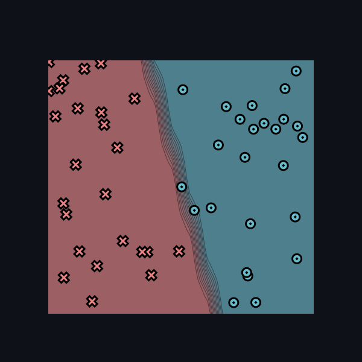

Parameters Utilised - 

* 3 Hidden Layers
* Learning Rate = 0.5
* Epochs = 500

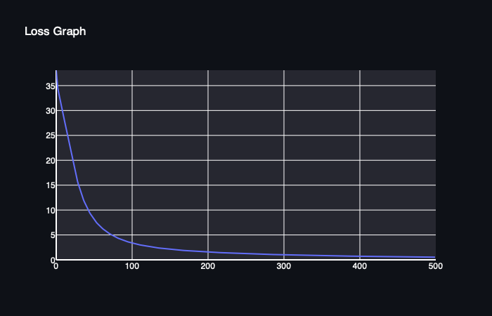

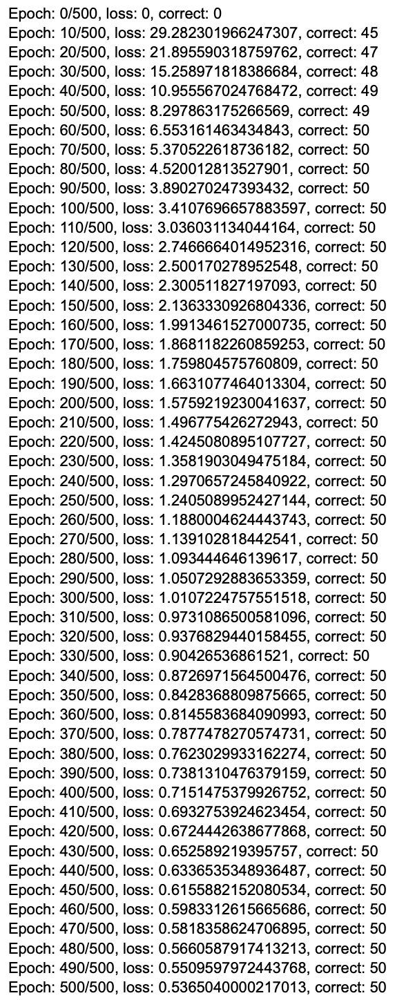

* Diagonal Dataset

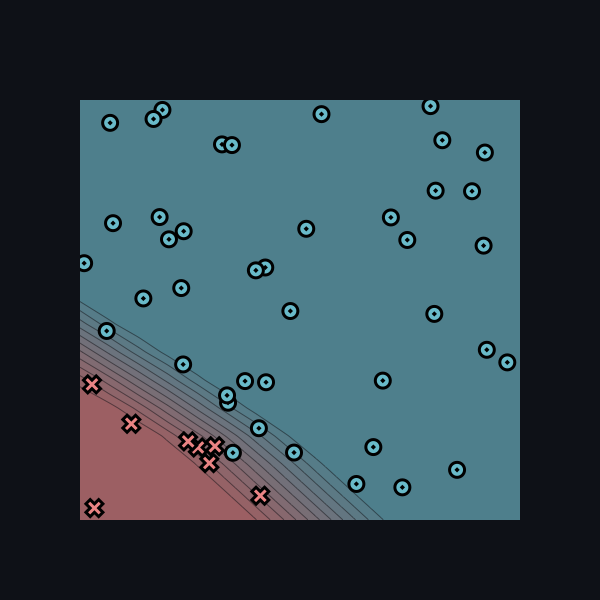

Parameters Utilised - 
* 8 hidden layers 
* Learning Rate = 0.1
* Epochs = 280

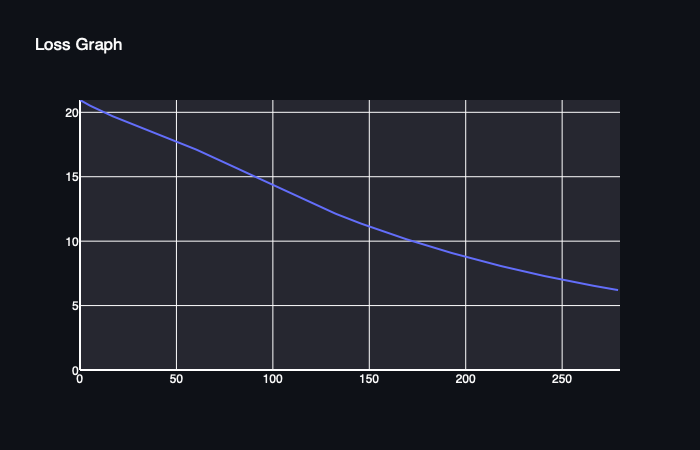

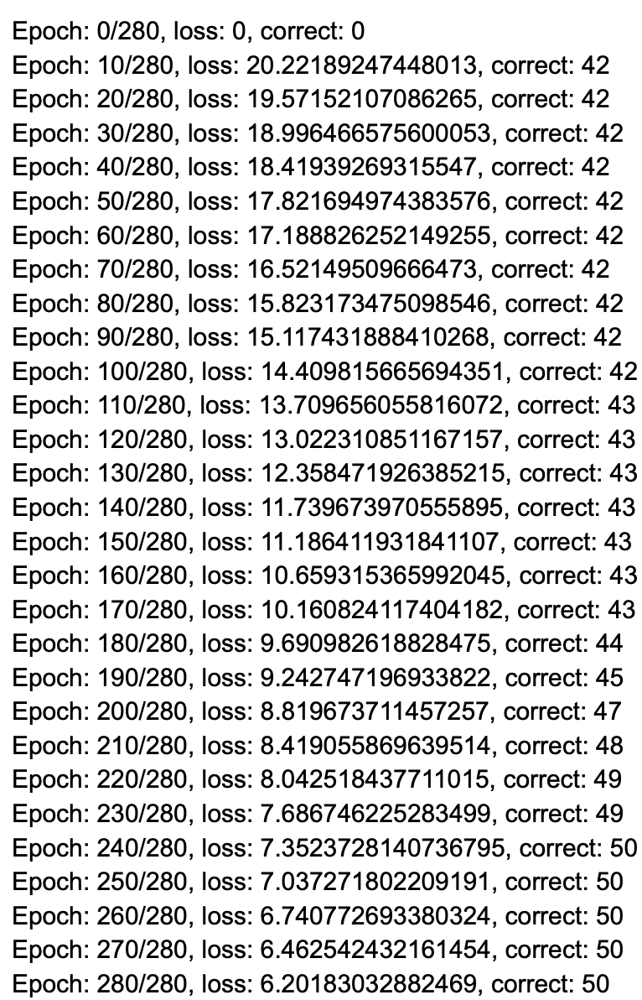

* Split Dataset

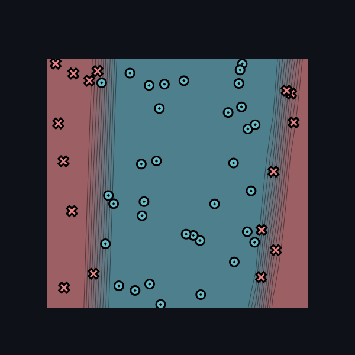

Parameters Utilised -
* 10 hidden layers
* Learning Rate = 0.1
* Epochs = 650

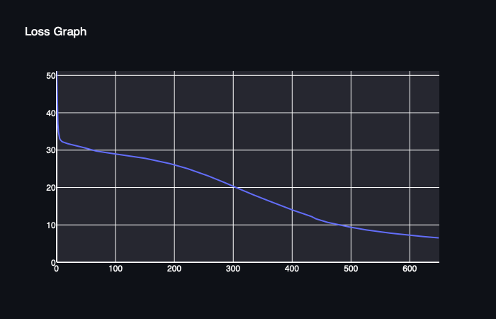

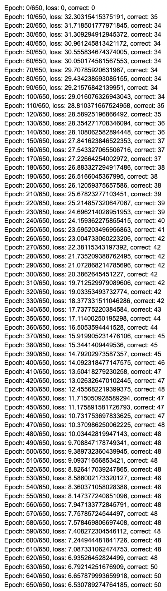

* Xor Dataset

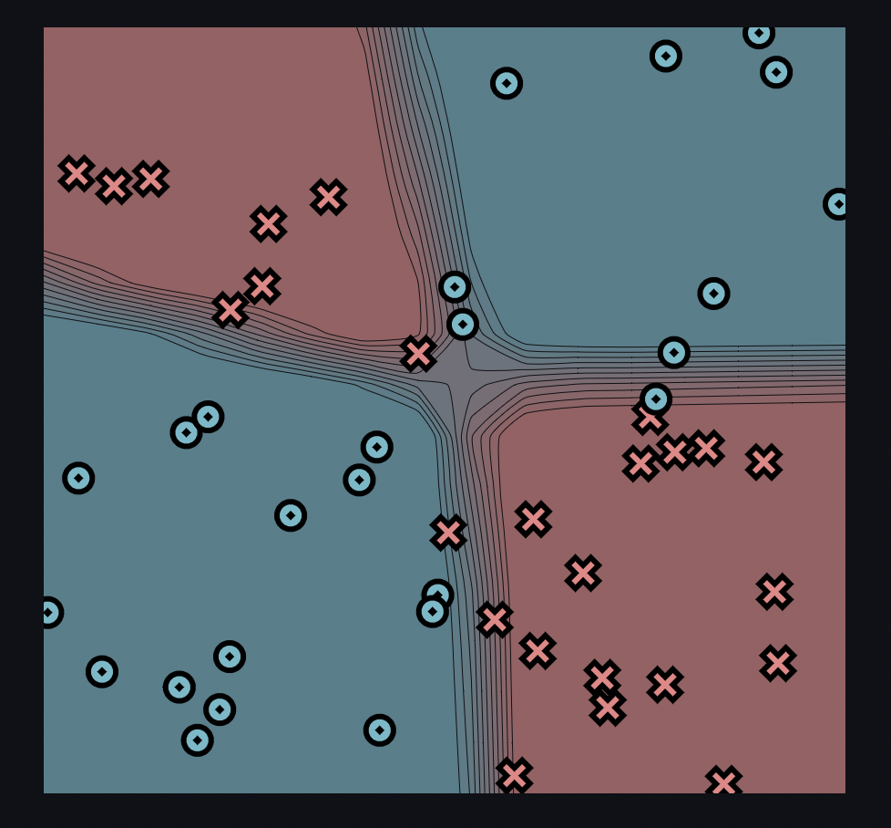

Parameters Utilised - 
* 16 hidden layers
* Learning Rate = 0.1  
* Epochs = 800

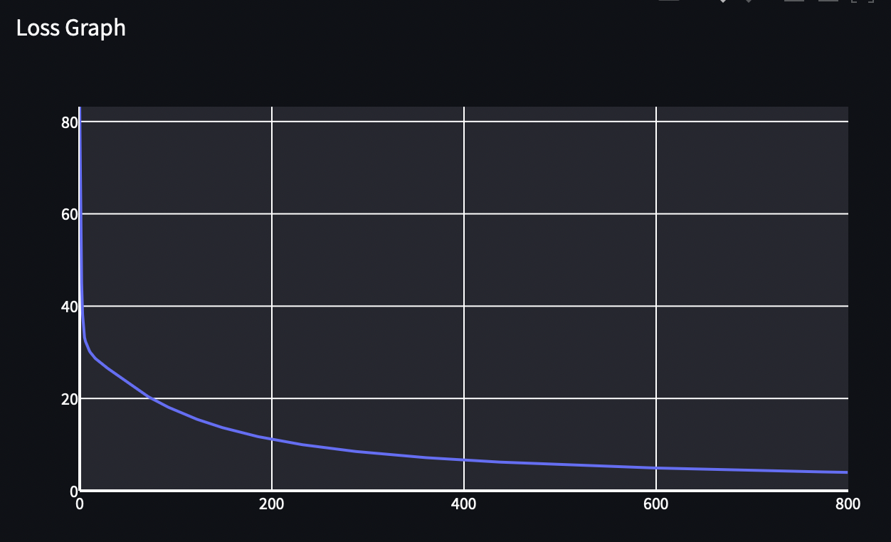

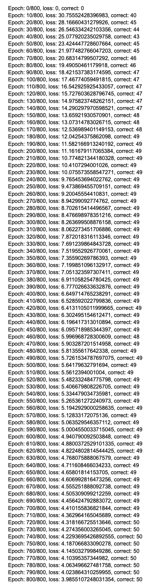


