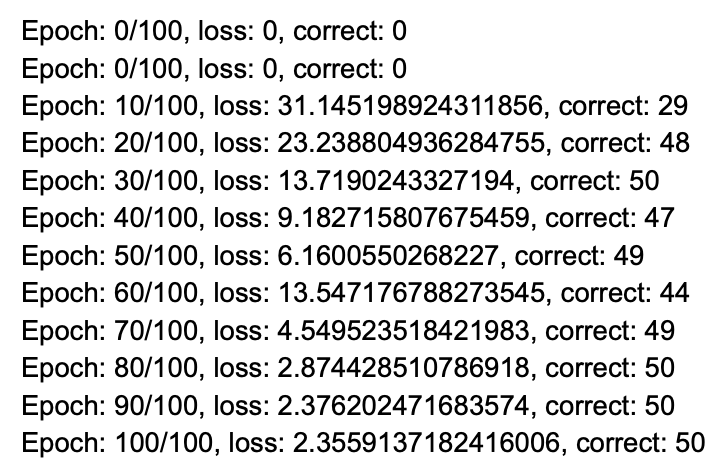
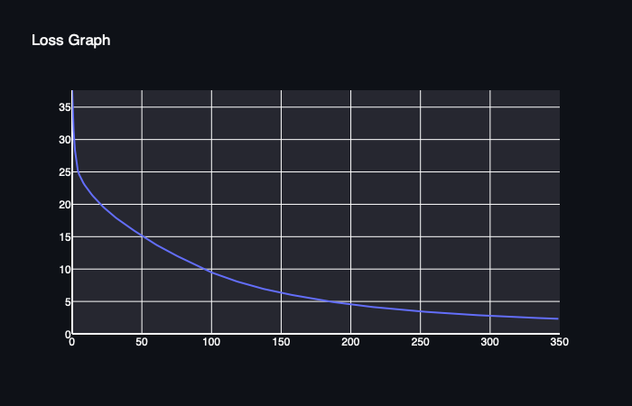

[](https://classroom.github.com/online_ide?assignment_repo_id=8736773&assignment_repo_type=AssignmentRepo)
# MiniTorch Module 2


* Docs: https://minitorch.github.io/

* Overview: https://minitorch.github.io/module2/module2/

This assignment requires the following files from the previous assignments. You can get these by running

```bash
python sync_previous_module.py previous-module-dir current-module-dir
```

The files that will be synced are:

        minitorch/operators.py minitorch/module.py minitorch/autodiff.py minitorch/scalar.py minitorch/module.py project/run_manual.py project/run_scalar.py

* Task 2.5 Visualization - 

50 data points utilised for each dataset

* Simple Dataset -


Parameters Utilised - 

* 3 Hidden Layers
* Learning Rate = 0.5
* Epochs = 100




* Diagonal Dataset


Parameters Utilised - 
* 8 hidden layers 
* Learning Rate = 0.1
* Epochs = 350




* Split Dataset


Parameters Utilised -
* 10 hidden layers
* Learning Rate = 0.1
* Epochs = 850


* Xor Dataset


Parameters Utilised - 
* 16 hidden layers
* Learning Rate = 0.1  
* Epochs = 850


