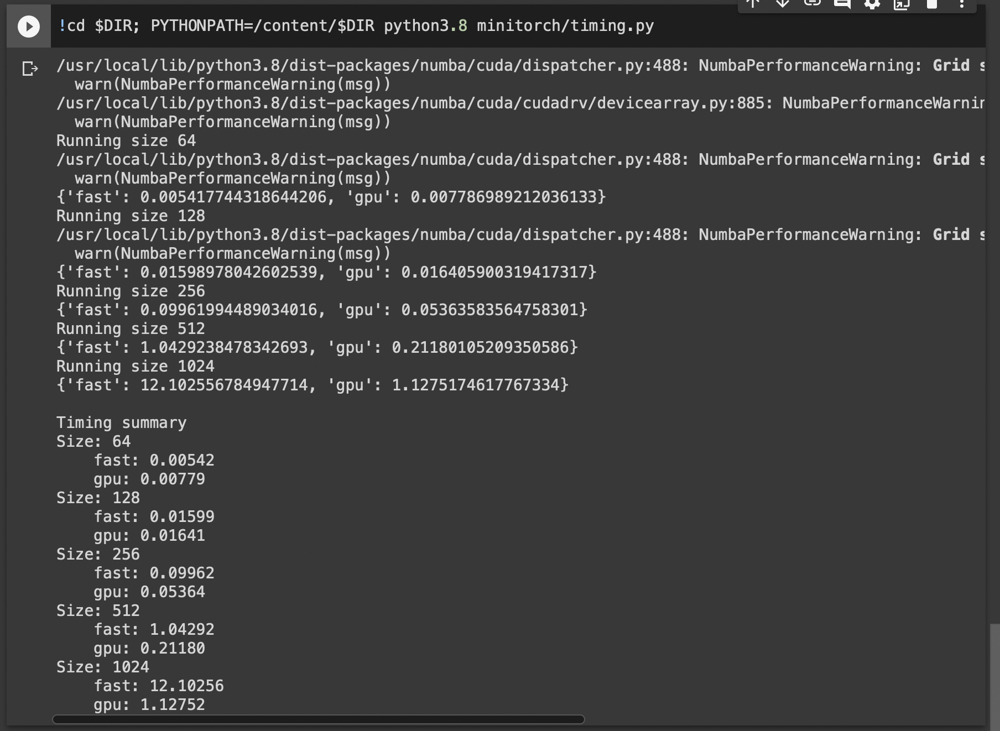
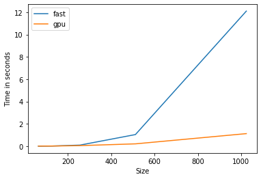

# MiniTorch Module 3


* Docs: https://minitorch.github.io/

* Overview: https://minitorch.github.io/module3.html


You will need to modify `tensor_functions.py` slightly in this assignment.

* Tests:

```
python run_tests.py
```

* Note:

Several of the tests for this assignment will only run if you are on a GPU machine and will not
run on github's test infrastructure. Please follow the instructions to setup up a colab machine
to run these tests.

This assignment requires the following files from the previous assignments. You can get these by running

```bash
python sync_previous_module.py previous-module-dir current-module-dir
```

The files that will be synced are:

        minitorch/tensor_data.py minitorch/tensor_functions.py minitorch/tensor_ops.py minitorch/operators.py minitorch/module.py minitorch/autodiff.py minitorch/module.py project/run_manual.py project/run_scalar.py project/run_tensor.py


* TASK 3.1 OUTPUT - 


MAP
 
================================================================================
 Parallel Accelerator Optimizing:  Function tensor_map.<locals>._map, 
/content/mle-module-3-NamanMakkar/minitorch/fast_ops.py (154)  
================================================================================


Parallel loop listing for  Function tensor_map.<locals>._map, /content/mle-module-3-NamanMakkar/minitorch/fast_ops.py (154) 
-------------------------------------------------------------------------------------------------------------------------------|loop #ID
    def _map(                                                                                                                  | 
        out: Storage,                                                                                                          | 
        out_shape: Shape,                                                                                                      | 
        out_strides: Strides,                                                                                                  | 
        in_storage: Storage,                                                                                                   | 
        in_shape: Shape,                                                                                                       | 
        in_strides: Strides,                                                                                                   | 
    ) -> None:                                                                                                                 | 
        # TODO: Implement for Task 3.1.                                                                                        | 
        if (len(out_strides) != len(in_strides) or (out_strides != in_strides).any() or (out_shape != in_shape).any()):--------| #0, 1
            for i in prange(len(out)):-----------------------------------------------------------------------------------------| #3
                out_index = np.empty(MAX_DIMS, np.int32)                                                                       | 
                in_index = np.empty(MAX_DIMS, np.int32)                                                                        | 
                to_index(i, out_shape, out_index)                                                                              | 
                broadcast_index(out_index, out_shape, in_shape, in_index)                                                      | 
                out[index_to_position(out_index, out_strides)] = fn(in_storage[index_to_position(in_index, in_strides)])       | 
        else:                                                                                                                  | 
            for i in prange(len(out)):-----------------------------------------------------------------------------------------| #2
                out[i] = fn(in_storage[i])                                                                                     | 
--------------------------------- Fusing loops ---------------------------------
Attempting fusion of parallel loops (combines loops with similar properties)...
Following the attempted fusion of parallel for-loops there are 4 parallel for-
loop(s) (originating from loops labelled: #0, #1, #3, #2).
--------------------------------------------------------------------------------
----------------------------- Before Optimisation ------------------------------
--------------------------------------------------------------------------------
------------------------------ After Optimisation ------------------------------
Parallel structure is already optimal.
--------------------------------------------------------------------------------
--------------------------------------------------------------------------------
 
---------------------------Loop invariant code motion---------------------------
Allocation hoisting:
The memory allocation derived from the instruction at /content/mle-
module-3-NamanMakkar/minitorch/fast_ops.py (165) is hoisted out of the parallel 
loop labelled #3 (it will be performed before the loop is executed and reused 
inside the loop):
   Allocation:: out_index = np.empty(MAX_DIMS, np.int32)
    - numpy.empty() is used for the allocation.
The memory allocation derived from the instruction at /content/mle-
module-3-NamanMakkar/minitorch/fast_ops.py (166) is hoisted out of the parallel 
loop labelled #3 (it will be performed before the loop is executed and reused 
inside the loop):
   Allocation:: in_index = np.empty(MAX_DIMS, np.int32)
    - numpy.empty() is used for the allocation.
None
ZIP
 
================================================================================
 Parallel Accelerator Optimizing:  Function tensor_zip.<locals>._zip, 
/content/mle-module-3-NamanMakkar/minitorch/fast_ops.py (199)  
================================================================================


Parallel loop listing for  Function tensor_zip.<locals>._zip, /content/mle-module-3-NamanMakkar/minitorch/fast_ops.py (199) 
-------------------------------------------------------------------------------------------------------------------------------------------------------------------------------------------------------------------------------------------|loop #ID
    def _zip(                                                                                                                                                                                                                              | 
        out: Storage,                                                                                                                                                                                                                      | 
        out_shape: Shape,                                                                                                                                                                                                                  | 
        out_strides: Strides,                                                                                                                                                                                                              | 
        a_storage: Storage,                                                                                                                                                                                                                | 
        a_shape: Shape,                                                                                                                                                                                                                    | 
        a_strides: Strides,                                                                                                                                                                                                                | 
        b_storage: Storage,                                                                                                                                                                                                                | 
        b_shape: Shape,                                                                                                                                                                                                                    | 
        b_strides: Strides,                                                                                                                                                                                                                | 
    ) -> None:                                                                                                                                                                                                                             | 
        # TODO: Implement for Task 3.1.                                                                                                                                                                                                    | 
        if (len(out_strides) != len(a_strides) or len(out_strides) != len(b_strides) or (out_strides != a_strides).any() or (out_strides != b_strides).any() or (out_shape != a_shape).any() or (out_shape != b_shape).any()):-------------| #4, 5, 6, 7
            for i in prange(len(out)):-----------------------------------------------------------------------------------------------------------------------------------------------------------------------------------------------------| #9
                out_index = np.empty(MAX_DIMS, np.int32)                                                                                                                                                                                   | 
                a_index = np.empty(MAX_DIMS, np.int32)                                                                                                                                                                                     | 
                b_index = np.empty(MAX_DIMS, np.int32)                                                                                                                                                                                     | 
                to_index(i, out_shape, out_index)                                                                                                                                                                                          | 
                broadcast_index(out_index, out_shape, a_shape, a_index)                                                                                                                                                                    | 
                broadcast_index(out_index, out_shape, b_shape, b_index)                                                                                                                                                                    | 
                a_data = a_storage[index_to_position(a_index, a_strides)]                                                                                                                                                                  | 
                b_data = b_storage[index_to_position(b_index, b_strides)]                                                                                                                                                                  | 
                out[index_to_position(out_index, out_strides)] = fn(a_data, b_data)                                                                                                                                                        | 
                                                                                                                                                                                                                                           | 
        else:                                                                                                                                                                                                                              | 
            for i in prange(len(out)):-----------------------------------------------------------------------------------------------------------------------------------------------------------------------------------------------------| #8
                out[i] = fn(a_storage[i], b_storage[i])                                                                                                                                                                                    | 
--------------------------------- Fusing loops ---------------------------------
Attempting fusion of parallel loops (combines loops with similar properties)...
Following the attempted fusion of parallel for-loops there are 6 parallel for-
loop(s) (originating from loops labelled: #4, #5, #6, #7, #9, #8).
--------------------------------------------------------------------------------
----------------------------- Before Optimisation ------------------------------
--------------------------------------------------------------------------------
------------------------------ After Optimisation ------------------------------
Parallel structure is already optimal.
--------------------------------------------------------------------------------
--------------------------------------------------------------------------------
 
---------------------------Loop invariant code motion---------------------------
Allocation hoisting:
The memory allocation derived from the instruction at /content/mle-
module-3-NamanMakkar/minitorch/fast_ops.py (213) is hoisted out of the parallel 
loop labelled #9 (it will be performed before the loop is executed and reused 
inside the loop):
   Allocation:: out_index = np.empty(MAX_DIMS, np.int32)
    - numpy.empty() is used for the allocation.
The memory allocation derived from the instruction at /content/mle-
module-3-NamanMakkar/minitorch/fast_ops.py (214) is hoisted out of the parallel 
loop labelled #9 (it will be performed before the loop is executed and reused 
inside the loop):
   Allocation:: a_index = np.empty(MAX_DIMS, np.int32)
    - numpy.empty() is used for the allocation.
The memory allocation derived from the instruction at /content/mle-
module-3-NamanMakkar/minitorch/fast_ops.py (215) is hoisted out of the parallel 
loop labelled #9 (it will be performed before the loop is executed and reused 
inside the loop):
   Allocation:: b_index = np.empty(MAX_DIMS, np.int32)
    - numpy.empty() is used for the allocation.
None
REDUCE
 
================================================================================
 Parallel Accelerator Optimizing:  Function tensor_reduce.<locals>._reduce, 
/content/mle-module-3-NamanMakkar/minitorch/fast_ops.py (249)  
================================================================================


Parallel loop listing for  Function tensor_reduce.<locals>._reduce, /content/mle-module-3-NamanMakkar/minitorch/fast_ops.py (249) 
-------------------------------------------------------------|loop #ID
    def _reduce(                                             | 
        out: Storage,                                        | 
        out_shape: Shape,                                    | 
        out_strides: Strides,                                | 
        a_storage: Storage,                                  | 
        a_shape: Shape,                                      | 
        a_strides: Strides,                                  | 
        reduce_dim: int,                                     | 
    ) -> None:                                               | 
        # TODO: Implement for Task 3.1.                      | 
        for i in prange(len(out)):---------------------------| #10
            out_index = np.empty(MAX_DIMS, np.int32)         | 
            dim = a_shape[reduce_dim]                        | 
            to_index(i, out_shape, out_index)                | 
            o = index_to_position(out_index, out_strides)    | 
            accum = out[o]                                   | 
            j = index_to_position(out_index, a_strides)      | 
            st = a_strides[reduce_dim]                       | 
            for s in range(dim):                             | 
                accum = fn(accum, a_storage[j])              | 
                j += st                                      | 
            out[o] = accum                                   | 
--------------------------------- Fusing loops ---------------------------------
Attempting fusion of parallel loops (combines loops with similar properties)...
Following the attempted fusion of parallel for-loops there are 1 parallel for-
loop(s) (originating from loops labelled: #10).
--------------------------------------------------------------------------------
----------------------------- Before Optimisation ------------------------------
--------------------------------------------------------------------------------
------------------------------ After Optimisation ------------------------------
Parallel structure is already optimal.
--------------------------------------------------------------------------------
--------------------------------------------------------------------------------
 
---------------------------Loop invariant code motion---------------------------
Allocation hoisting:
The memory allocation derived from the instruction at /content/mle-
module-3-NamanMakkar/minitorch/fast_ops.py (260) is hoisted out of the parallel 
loop labelled #10 (it will be performed before the loop is executed and reused 
inside the loop):
   Allocation:: out_index = np.empty(MAX_DIMS, np.int32)
    - numpy.empty() is used for the allocation.
None
MATRIX MULTIPLY
 
================================================================================
 Parallel Accelerator Optimizing:  Function _tensor_matrix_multiply, 
/content/mle-module-3-NamanMakkar/minitorch/fast_ops.py (275)  
================================================================================


Parallel loop listing for  Function _tensor_matrix_multiply, /content/mle-module-3-NamanMakkar/minitorch/fast_ops.py (275) 
------------------------------------------------------------------------------------------------------------------------------------------------------------------------------------------------------|loop #ID
def _tensor_matrix_multiply(                                                                                                                                                                          | 
    out: Storage,                                                                                                                                                                                     | 
    out_shape: Shape,                                                                                                                                                                                 | 
    out_strides: Strides,                                                                                                                                                                             | 
    a_storage: Storage,                                                                                                                                                                               | 
    a_shape: Shape,                                                                                                                                                                                   | 
    a_strides: Strides,                                                                                                                                                                               | 
    b_storage: Storage,                                                                                                                                                                               | 
    b_shape: Shape,                                                                                                                                                                                   | 
    b_strides: Strides,                                                                                                                                                                               | 
) -> None:                                                                                                                                                                                            | 
    """                                                                                                                                                                                               | 
    NUMBA tensor matrix multiply function.                                                                                                                                                            | 
                                                                                                                                                                                                      | 
    Should work for any tensor shapes that broadcast as long as                                                                                                                                       | 
                                                                                                                                                                                                      | 
    ```                                                                                                                                                                                               | 
    assert a_shape[-1] == b_shape[-2]                                                                                                                                                                 | 
    ```                                                                                                                                                                                               | 
                                                                                                                                                                                                      | 
    Optimizations:                                                                                                                                                                                    | 
                                                                                                                                                                                                      | 
    * Outer loop in parallel                                                                                                                                                                          | 
    * No index buffers or function calls                                                                                                                                                              | 
    * Inner loop should have no global writes, 1 multiply.                                                                                                                                            | 
                                                                                                                                                                                                      | 
                                                                                                                                                                                                      | 
    Args:                                                                                                                                                                                             | 
        out (Storage): storage for `out` tensor                                                                                                                                                       | 
        out_shape (Shape): shape for `out` tensor                                                                                                                                                     | 
        out_strides (Strides): strides for `out` tensor                                                                                                                                               | 
        a_storage (Storage): storage for `a` tensor                                                                                                                                                   | 
        a_shape (Shape): shape for `a` tensor                                                                                                                                                         | 
        a_strides (Strides): strides for `a` tensor                                                                                                                                                   | 
        b_storage (Storage): storage for `b` tensor                                                                                                                                                   | 
        b_shape (Shape): shape for `b` tensor                                                                                                                                                         | 
        b_strides (Strides): strides for `b` tensor                                                                                                                                                   | 
                                                                                                                                                                                                      | 
    Returns:                                                                                                                                                                                          | 
        None : Fills in `out`                                                                                                                                                                         | 
    """                                                                                                                                                                                               | 
    a_batch_stride = a_strides[0] if a_shape[0] > 1 else 0                                                                                                                                            | 
    b_batch_stride = b_strides[0] if b_shape[0] > 1 else 0                                                                                                                                            | 
                                                                                                                                                                                                      | 
    # We first loop through the batch dimension which is out_shape[0]                                                                                                                                 | 
    for n in prange(out_shape[0]):--------------------------------------------------------------------------------------------------------------------------------------------------------------------| #13
        # We then loop through the 1th dimension of a                                                                                                                                                 | 
        for i in prange(out_shape[1]):----------------------------------------------------------------------------------------------------------------------------------------------------------------| #12
            # And loop through the 2th dimension of b                                                                                                                                                 | 
            for j in prange(out_shape[2]):------------------------------------------------------------------------------------------------------------------------------------------------------------| #11
                # We get the absolute positions in a_storage and b_storage by multiplying the indices with the strides                                                                                | 
                a_idx = n * a_batch_stride + i * a_strides[1]                                                                                                                                         | 
                b_idx = n * b_batch_stride + j * b_strides[2]                                                                                                                                         | 
                accum = 0.0                                                                                                                                                                           | 
                # We use the variable accum to store the inner product of matrices a and b while looping through the common dimension k which is the 2th dimension of a and the 1th dimension of b    | 
                for k in range(a_shape[2]):                                                                                                                                                           | 
                    accum += a_storage[a_idx] * b_storage[b_idx]                                                                                                                                      | 
                    # We update the position for both a and b in their common dimension (2th for a and 1th for b) with the help of the strides                                                        | 
                    a_idx += a_strides[2]                                                                                                                                                             | 
                    b_idx += b_strides[1]                                                                                                                                                             | 
                # We calculate the absolute position in out by multiplying the strides with the indices                                                                                               | 
                out[n * out_strides[0] + i * out_strides[1] + j * out_strides[2]] = accum                                                                                                             | 
--------------------------------- Fusing loops ---------------------------------
Attempting fusion of parallel loops (combines loops with similar properties)...
Following the attempted fusion of parallel for-loops there are 2 parallel for-
loop(s) (originating from loops labelled: #13, #12).
--------------------------------------------------------------------------------
---------------------------- Optimising loop nests -----------------------------
Attempting loop nest rewrites (optimising for the largest parallel loops)...
 
+--13 is a parallel loop
   +--12 --> rewritten as a serial loop
      +--11 --> rewritten as a serial loop
--------------------------------------------------------------------------------
----------------------------- Before Optimisation ------------------------------
Parallel region 0:
+--13 (parallel)
   +--12 (parallel)
      +--11 (parallel)


--------------------------------------------------------------------------------
------------------------------ After Optimisation ------------------------------
Parallel region 0:
+--13 (parallel)
   +--12 (serial)
      +--11 (serial)


 
Parallel region 0 (loop #13) had 0 loop(s) fused and 2 loop(s) serialized as 
part of the larger parallel loop (#13).
--------------------------------------------------------------------------------
--------------------------------------------------------------------------------
 
---------------------------Loop invariant code motion---------------------------
Allocation hoisting:
No allocation hoisting found
None


* Task 3.4 Tests -



* Task 3.4 Plot -



* Task 3.5 Training -

* Split Dataset -

Hidden Layers = 100
Learning Rate = 0.05

Epoch  0  time  9.88935399055481

Epoch  0  loss  7.446916986416462 correct 24

Epoch  1  time  0.20184803009033203

Epoch  2  time  0.19181108474731445

Epoch  3  time  0.2055220603942871

Epoch  4  time  0.19355010986328125

Epoch  5  time  0.19379305839538574

Epoch  6  time  0.21861505508422852

Epoch  7  time  0.19815397262573242

Epoch  8  time  0.20452499389648438

Epoch  9  time  0.2022552490234375

Epoch  10  time  0.20113587379455566

Epoch  10  loss  6.148127148433527 correct 27

Epoch  11  time  0.20062518119812012

Epoch  12  time  0.19806504249572754

Epoch  13  time  0.194976806640625

Epoch  14  time  0.20212626457214355

Epoch  15  time  0.19138407707214355

Epoch  16  time  0.19142508506774902

Epoch  17  time  0.23707818984985352

Epoch  18  time  0.19326186180114746

Epoch  19  time  0.19342803955078125

Epoch  20  time  0.1956040859222412

Epoch  20  loss  4.993522255792328 correct 41

Epoch  21  time  0.19369292259216309

Epoch  22  time  0.19292092323303223

Epoch  23  time  0.19470691680908203

Epoch  24  time  0.19320201873779297

Epoch  25  time  0.20758390426635742

Epoch  26  time  0.1932990550994873

Epoch  27  time  0.19331812858581543

Epoch  28  time  0.18737506866455078

Epoch  29  time  0.19452309608459473

Epoch  30  time  0.19511175155639648

Epoch  30  loss  5.5758876332406215 correct 37

Epoch  31  time  0.1947641372680664

Epoch  32  time  0.19319510459899902

Epoch  33  time  0.19283580780029297

Epoch  34  time  0.19496703147888184

Epoch  35  time  0.1873178482055664

Epoch  36  time  0.1972661018371582

Epoch  37  time  0.1962738037109375

Epoch  38  time  0.19573307037353516

Epoch  39  time  0.20444202423095703

Epoch  40  time  0.18986105918884277

Epoch  40  loss  4.485114263380853 correct 47

Epoch  41  time  0.19328784942626953

Epoch  42  time  0.1910698413848877

Epoch  43  time  0.191925048828125

Epoch  44  time  0.1900501251220703

Epoch  45  time  0.1897730827331543

Epoch  46  time  0.19718313217163086

Epoch  47  time  0.19040203094482422

Epoch  48  time  0.19378089904785156

Epoch  49  time  0.19289922714233398

Epoch  50  time  0.19530797004699707

Epoch  50  loss  3.460768028221973 correct 47

Epoch  51  time  0.1974499225616455

Epoch  52  time  0.20486688613891602

Epoch  53  time  0.1901559829711914

Epoch  54  time  0.19393515586853027

Epoch  55  time  0.19282889366149902

Epoch  56  time  0.1944129467010498

Epoch  57  time  0.19124460220336914

Epoch  58  time  0.1978621482849121

Epoch  59  time  0.19899702072143555

Epoch  60  time  0.19147205352783203

Epoch  60  loss  1.923386291116096 correct 50

Epoch  61  time  0.19157981872558594

Epoch  62  time  0.19195294380187988

Epoch  63  time  0.19711089134216309

Epoch  64  time  0.1920180320739746

Epoch  65  time  0.19864583015441895

Epoch  66  time  0.199082612991333

Epoch  67  time  0.1956942081451416

Epoch  68  time  0.19294977188110352

Epoch  69  time  0.19003701210021973

Epoch  70  time  0.18983030319213867

Epoch  70  loss  2.3548720225900386 correct 50

Epoch  71  time  0.1962881088256836

Epoch  72  time  0.19477081298828125

Epoch  73  time  0.1934199333190918

Epoch  74  time  0.19374585151672363

Epoch  75  time  0.193861722946167

Epoch  76  time  0.19138097763061523

Epoch  77  time  0.19358086585998535

Epoch  78  time  0.19649386405944824

Epoch  79  time  0.1956040859222412

Epoch  80  time  0.19566798210144043

Epoch  80  loss  1.497754032837765 correct 50

Epoch  81  time  0.18982791900634766

Epoch  82  time  0.19255971908569336

Epoch  83  time  0.19344782829284668

Epoch  84  time  0.19193124771118164

Epoch  85  time  0.1902470588684082

Epoch  86  time  0.191633939743042

Epoch  87  time  0.19310212135314941

Epoch  88  time  0.18985295295715332

Epoch  89  time  0.19193696975708008

Epoch  90  time  0.19447803497314453

Epoch  90  loss  1.6549065534784555 correct 49

Epoch  91  time  0.19276690483093262

Epoch  92  time  0.22173380851745605

Epoch  93  time  0.22165298461914062

Epoch  94  time  0.2066192626953125

Epoch  95  time  0.21190094947814941

Epoch  96  time  0.20916008949279785

Epoch  97  time  0.21461892127990723

Epoch  98  time  0.20760703086853027

Epoch  99  time  0.20430421829223633

Epoch  100  time  0.20940184593200684

Epoch  100  loss  1.4191149656692652 correct 50

Epoch  101  time  0.21367383003234863

Epoch  102  time  0.20966100692749023

Epoch  103  time  0.20701909065246582

Epoch  104  time  0.20183777809143066

Epoch  105  time  0.19757509231567383

Epoch  106  time  0.20134401321411133

Epoch  107  time  0.1941530704498291

Epoch  108  time  0.21768665313720703

Epoch  109  time  0.20751285552978516

Epoch  110  time  0.2099909782409668

Epoch  110  loss  0.7355285125850854 correct 50

Epoch  111  time  0.2066650390625

Epoch  112  time  0.21969294548034668

Epoch  113  time  0.20933198928833008

Epoch  114  time  0.20320725440979004

Epoch  115  time  0.21011924743652344

Epoch  116  time  0.20405983924865723

Epoch  117  time  0.1968381404876709

Epoch  118  time  0.19193720817565918

Epoch  119  time  0.197617769241333

Epoch  120  time  0.1940169334411621

Epoch  120  loss  1.4963404852643456 correct 50

Epoch  121  time  0.19443202018737793

Epoch  122  time  0.19647216796875

Epoch  123  time  0.19301080703735352

Epoch  124  time  0.20284318923950195

Epoch  125  time  0.19244813919067383

Epoch  126  time  0.19348812103271484

Epoch  127  time  0.20072007179260254

Epoch  128  time  0.1940760612487793

Epoch  129  time  0.19244742393493652

Epoch  130  time  0.19562697410583496

Epoch  130  loss  0.7346060690908229 correct 50

Epoch  131  time  0.19352197647094727

Epoch  132  time  0.19849586486816406

Epoch  133  time  0.1969611644744873

Epoch  134  time  0.20221996307373047

Epoch  135  time  0.19268584251403809

Epoch  136  time  0.1945018768310547

Epoch  137  time  0.20303797721862793

Epoch  138  time  0.19105982780456543

Epoch  139  time  0.19335603713989258

Epoch  140  time  0.1982710361480713

Epoch  140  loss  0.8421667521528569 correct 50

Epoch  141  time  0.19400501251220703

Epoch  142  time  0.1973710060119629

Epoch  143  time  0.1969296932220459

Epoch  144  time  0.19693398475646973

Epoch  145  time  0.19696998596191406

Epoch  146  time  0.2000880241394043

Epoch  147  time  0.19298696517944336

Epoch  148  time  0.19571208953857422

Epoch  149  time  0.1930990219116211

Epoch  150  time  0.18824195861816406

Epoch  150  loss  0.5059021336467573 correct 50

Epoch  151  time  0.20511412620544434

Epoch  152  time  0.19293689727783203

Epoch  153  time  0.1906750202178955

Epoch  154  time  0.19783496856689453

Epoch  155  time  0.19136404991149902

Epoch  156  time  0.192641019821167

Epoch  157  time  0.19324803352355957

Epoch  158  time  0.19228315353393555

Epoch  159  time  0.1995840072631836

Epoch  160  time  0.19486093521118164

Epoch  160  loss  0.33372278135807937 correct 50

Epoch  161  time  0.19388604164123535

Epoch  162  time  0.19034814834594727

Epoch  163  time  0.19347190856933594

Epoch  164  time  0.19196486473083496

Epoch  165  time  0.1901082992553711

Epoch  166  time  0.1924431324005127

Epoch  167  time  0.19836902618408203

Epoch  168  time  0.19332408905029297

Epoch  169  time  0.1968390941619873

Epoch  170  time  0.19213271141052246

Epoch  170  loss  0.5454227547305958 correct 50

Epoch  171  time  0.1907358169555664

Epoch  172  time  0.192551851272583

Epoch  173  time  0.19373011589050293

Epoch  174  time  0.20580196380615234

Epoch  175  time  0.20675992965698242

Epoch  176  time  0.19810986518859863

Epoch  177  time  0.19281792640686035

Epoch  178  time  0.19748210906982422

Epoch  179  time  0.19244170188903809

Epoch  180  time  0.19719195365905762

Epoch  180  loss  0.3494209695619518 correct 50

Epoch  181  time  0.19618582725524902

Epoch  182  time  0.19601082801818848

Epoch  183  time  0.190291166305542

Epoch  184  time  0.1928110122680664

Epoch  185  time  0.19477128982543945

Epoch  186  time  0.1953589916229248

Epoch  187  time  0.1906578540802002

Epoch  188  time  0.19858098030090332

Epoch  189  time  0.19660520553588867

Epoch  190  time  0.19619321823120117

Epoch  190  loss  0.7772506256048861 correct 50

Epoch  191  time  0.2000420093536377

Epoch  192  time  0.1936628818511963

Epoch  193  time  0.19191312789916992

Epoch  194  time  0.1908249855041504

Epoch  195  time  0.1916358470916748

Epoch  196  time  0.19047975540161133

Epoch  197  time  0.23801183700561523

Epoch  198  time  0.21267986297607422

Epoch  199  time  0.2183518409729004

Epoch  200  time  0.21014690399169922

Epoch  200  loss  0.8228925893998431 correct 50

Epoch  201  time  0.2023155689239502

Epoch  202  time  0.20196795463562012

Epoch  203  time  0.1957550048828125

Epoch  204  time  0.19815778732299805

Epoch  205  time  0.19108009338378906

Epoch  206  time  0.19700908660888672

Epoch  207  time  0.1916489601135254

Epoch  208  time  0.1878039836883545

Epoch  209  time  0.19700288772583008

Epoch  210  time  0.22168183326721191

Epoch  210  loss  0.12621524616629132 correct 50

Epoch  211  time  0.20456695556640625

Epoch  212  time  0.18823003768920898

Epoch  213  time  0.19565892219543457

Epoch  214  time  0.20148491859436035

Epoch  215  time  0.20508790016174316

Epoch  216  time  0.19990992546081543

Epoch  217  time  0.20482301712036133

Epoch  218  time  0.2015979290008545

Epoch  219  time  0.19980382919311523

Epoch  220  time  0.19810986518859863

Epoch  220  loss  0.41660246282919894 correct 50

Epoch  221  time  0.19743108749389648

Epoch  222  time  0.20057010650634766

Epoch  223  time  0.19344592094421387

Epoch  224  time  0.19423604011535645

Epoch  225  time  0.20169591903686523

Epoch  226  time  0.19576120376586914

Epoch  227  time  0.1931300163269043

Epoch  228  time  0.193436861038208

Epoch  229  time  0.19171619415283203

Epoch  230  time  0.19362521171569824

Epoch  230  loss  0.21170240009594427 correct 50

Epoch  231  time  0.1895742416381836

Epoch  232  time  0.19441628456115723

Epoch  233  time  0.19088387489318848

Epoch  234  time  0.1896660327911377

Epoch  235  time  0.1920790672302246

Epoch  236  time  0.19233417510986328

Epoch  237  time  0.19084501266479492

Epoch  238  time  0.19498896598815918

Epoch  239  time  0.19387078285217285

Epoch  240  time  0.19536089897155762

Epoch  240  loss  0.3818158626774109 correct 50

Epoch  241  time  0.19409990310668945

Epoch  242  time  0.1953141689300537

Epoch  243  time  0.1935408115386963

Epoch  244  time  0.1968398094177246

Epoch  245  time  0.19297194480895996

Epoch  246  time  0.19047188758850098

Epoch  247  time  0.19265103340148926

Epoch  248  time  0.19188714027404785

Epoch  249  time  0.19394183158874512

Epoch  250  time  0.1954360008239746

Epoch  250  loss  0.7212430385446615 correct 50

Epoch  251  time  0.19542384147644043

Epoch  252  time  0.2001960277557373

Epoch  253  time  0.19367575645446777

Epoch  254  time  0.19302606582641602

Epoch  255  time  0.19321274757385254

Epoch  256  time  0.19173502922058105

Epoch  257  time  0.19398283958435059

Epoch  258  time  0.1959669589996338

Epoch  259  time  0.19210290908813477

Epoch  260  time  0.21082425117492676

Epoch  260  loss  0.40244573686685015 correct 50

Epoch  261  time  0.1940019130706787

Epoch  262  time  0.19412016868591309

Epoch  263  time  0.1924600601196289

Epoch  264  time  0.19859886169433594

Epoch  265  time  0.19129490852355957

Epoch  266  time  0.1940770149230957

Epoch  267  time  0.18770408630371094

Epoch  268  time  0.1897590160369873

Epoch  269  time  0.18890380859375

Epoch  270  time  0.23169803619384766

Epoch  270  loss  0.11425873742300689 correct 50

Epoch  271  time  0.19336795806884766

Epoch  272  time  0.1936180591583252

Epoch  273  time  0.20475530624389648

Epoch  274  time  0.19959497451782227

Epoch  275  time  0.19211101531982422

Epoch  276  time  0.19096088409423828

Epoch  277  time  0.19671225547790527

Epoch  278  time  0.19393110275268555

Epoch  279  time  0.19062495231628418

Epoch  280  time  0.19226384162902832

Epoch  280  loss  0.07621881439159839 correct 50

Epoch  281  time  0.19360804557800293

Epoch  282  time  0.1923999786376953

Epoch  283  time  0.1916208267211914

Epoch  284  time  0.19264793395996094

Epoch  285  time  0.2006998062133789

Epoch  286  time  0.19356703758239746

Epoch  287  time  0.20057201385498047

Epoch  288  time  0.19183707237243652

Epoch  289  time  0.1916811466217041

Epoch  290  time  0.19061899185180664

Epoch  290  loss  1.2556585153442161 correct 48

Epoch  291  time  0.1960897445678711

Epoch  292  time  0.19319796562194824

Epoch  293  time  0.19739913940429688

Epoch  294  time  0.19170808792114258

Epoch  295  time  0.1918020248413086

Epoch  296  time  0.19455790519714355

Epoch  297  time  0.1937878131866455

Epoch  298  time  0.1947801113128662

Epoch  299  time  0.19182705879211426

Epoch  300  time  0.20394110679626465

Epoch  300  loss  0.25039602180333287 correct 50

Epoch  301  time  0.20311808586120605

Epoch  302  time  0.19248008728027344

Epoch  303  time  0.1887049674987793

Epoch  304  time  0.19078302383422852

Epoch  305  time  0.19861912727355957

Epoch  306  time  0.19471311569213867

Epoch  307  time  0.19452691078186035

Epoch  308  time  0.1951289176940918

Epoch  309  time  0.19060921669006348

Epoch  310  time  0.18962788581848145

Epoch  310  loss  0.3611329708771624 correct 50

Epoch  311  time  0.19084787368774414

Epoch  312  time  0.1945939064025879

Epoch  313  time  0.19520998001098633

Epoch  314  time  0.19139504432678223

Epoch  315  time  0.19255590438842773

Epoch  316  time  0.1930549144744873

Epoch  317  time  0.19817495346069336

Epoch  318  time  0.19257616996765137

Epoch  319  time  0.19415497779846191

Epoch  320  time  0.20157909393310547

Epoch  320  loss  0.6567488300009725 correct 50

Epoch  321  time  0.19314217567443848

Epoch  322  time  0.19288897514343262

Epoch  323  time  0.19458603858947754

Epoch  324  time  0.1909470558166504

Epoch  325  time  0.1957399845123291

Epoch  326  time  0.19412469863891602

Epoch  327  time  0.19254708290100098

Epoch  328  time  0.19302606582641602

Epoch  329  time  0.1933269500732422

Epoch  330  time  0.19449710845947266

Epoch  330  loss  0.8925978936126411 correct 50

Epoch  331  time  0.19340300559997559

Epoch  332  time  0.1943359375

Epoch  333  time  0.19126558303833008

Epoch  334  time  0.19482064247131348

Epoch  335  time  0.19382190704345703

Epoch  336  time  0.1975998878479004

Epoch  337  time  0.19554400444030762

Epoch  338  time  0.19089913368225098

Epoch  339  time  0.19245481491088867

Epoch  340  time  0.19778776168823242

Epoch  340  loss  0.30407553974742085 correct 50

Epoch  341  time  0.19374489784240723

Epoch  342  time  0.19511914253234863

Epoch  343  time  0.19474005699157715

Epoch  344  time  0.19402384757995605

Epoch  345  time  0.19510102272033691

Epoch  346  time  0.19523096084594727

Epoch  347  time  0.19237112998962402

Epoch  348  time  0.19606614112854004

Epoch  349  time  0.19036316871643066

Average time per epoch 0.22411284582955496 (for 350 epochs)

* Simple Dataset

Hidden Layers = 100
Learning Rate = 0.05

Epoch  0  time  9.964008808135986

Epoch  0  loss  5.296263017151889 correct 46

Epoch  1  time  0.2073202133178711

Epoch  2  time  0.19929099082946777

Epoch  3  time  0.20462632179260254

Epoch  4  time  0.19695186614990234

Epoch  5  time  0.19293832778930664

Epoch  6  time  0.19156694412231445

Epoch  7  time  0.19083690643310547

Epoch  8  time  0.19416308403015137

Epoch  9  time  0.2000730037689209

Epoch  10  time  0.1967451572418213

Epoch  10  loss  2.388540448558878 correct 49

Epoch  11  time  0.20163702964782715

Epoch  12  time  0.19693803787231445

Epoch  13  time  0.1938469409942627

Epoch  14  time  0.19427704811096191

Epoch  15  time  0.19069170951843262

Epoch  16  time  0.205610990524292

Epoch  17  time  0.2403271198272705

Epoch  18  time  0.19603681564331055

Epoch  19  time  0.18944573402404785

Epoch  20  time  0.19449496269226074

Epoch  20  loss  1.2119730264183262 correct 50

Epoch  21  time  0.19394683837890625

Epoch  22  time  0.19263887405395508

Epoch  23  time  0.19810104370117188

Epoch  24  time  0.1932048797607422

Epoch  25  time  0.19506406784057617

Epoch  26  time  0.19540834426879883

Epoch  27  time  0.19342803955078125

Epoch  28  time  0.1941840648651123

Epoch  29  time  0.2094411849975586

Epoch  30  time  0.19345784187316895

Epoch  30  loss  1.6062151758752574 correct 50

Epoch  31  time  0.19084811210632324

Epoch  32  time  0.19112396240234375

Epoch  33  time  0.19077181816101074

Epoch  34  time  0.19432592391967773

Epoch  35  time  0.19226431846618652

Epoch  36  time  0.19631099700927734

Epoch  37  time  0.19248628616333008

Epoch  38  time  0.19358015060424805

Epoch  39  time  0.19161701202392578

Epoch  40  time  0.19900107383728027

Epoch  40  loss  0.5757445902866315 correct 50

Epoch  41  time  0.19401288032531738

Epoch  42  time  0.19260478019714355

Epoch  43  time  0.1979539394378662

Epoch  44  time  0.19304656982421875

Epoch  45  time  0.19285869598388672

Epoch  46  time  0.19123196601867676

Epoch  47  time  0.19314789772033691

Epoch  48  time  0.19138097763061523

Epoch  49  time  0.1936030387878418

Epoch  50  time  0.19381403923034668

Epoch  50  loss  0.3443891840976385 correct 49

Epoch  51  time  0.19330716133117676

Epoch  52  time  0.19122886657714844

Epoch  53  time  0.19107604026794434

Epoch  54  time  0.19356489181518555

Epoch  55  time  0.19806408882141113

Epoch  56  time  0.21135210990905762

Epoch  57  time  0.1960127353668213

Epoch  58  time  0.19379186630249023

Epoch  59  time  0.19442105293273926

Epoch  60  time  0.1952662467956543

Epoch  60  loss  0.6846401700008137 correct 49

Epoch  61  time  0.20498013496398926

Epoch  62  time  0.18957209587097168

Epoch  63  time  0.19627785682678223

Epoch  64  time  0.19078707695007324

Epoch  65  time  0.1977400779724121

Epoch  66  time  0.19446015357971191

Epoch  67  time  0.23453807830810547

Epoch  68  time  0.19500017166137695

Epoch  69  time  0.19054794311523438

Epoch  70  time  0.19740605354309082

Epoch  70  loss  1.0119784408728365 correct 50

Epoch  71  time  0.19270682334899902

Epoch  72  time  0.19134807586669922

Epoch  73  time  0.19259333610534668

Epoch  74  time  0.19495391845703125

Epoch  75  time  0.2017500400543213

Epoch  76  time  0.1950528621673584

Epoch  77  time  0.19555091857910156

Epoch  78  time  0.1974930763244629

Epoch  79  time  0.18944978713989258

Epoch  80  time  0.19146990776062012

Epoch  80  loss  0.6824890214653405 correct 50

Epoch  81  time  0.1936960220336914

Epoch  82  time  0.1916956901550293

Epoch  83  time  0.19484400749206543

Epoch  84  time  0.19112610816955566

Epoch  85  time  0.1947948932647705

Epoch  86  time  0.1936650276184082

Epoch  87  time  0.19344115257263184

Epoch  88  time  0.19217610359191895

Epoch  89  time  0.19385528564453125

Epoch  90  time  0.19496607780456543

Epoch  90  loss  0.4350252371976725 correct 49

Epoch  91  time  0.19635891914367676

Epoch  92  time  0.19743704795837402

Epoch  93  time  0.19179487228393555

Epoch  94  time  0.19584894180297852

Epoch  95  time  0.19422006607055664

Epoch  96  time  0.19480609893798828

Epoch  97  time  0.19236397743225098

Epoch  98  time  0.1941068172454834

Epoch  99  time  0.19196176528930664

Epoch  100  time  0.19562411308288574

Epoch  100  loss  0.26224877200634167 correct 50

Epoch  101  time  0.1955420970916748

Epoch  102  time  0.19495487213134766

Epoch  103  time  0.19464588165283203

Epoch  104  time  0.19823908805847168

Epoch  105  time  0.19545507431030273

Epoch  106  time  0.19144487380981445

Epoch  107  time  0.19392895698547363

Epoch  108  time  0.19393110275268555

Epoch  109  time  0.19276785850524902

Epoch  110  time  0.19532275199890137

Epoch  110  loss  0.32180142470083706 correct 50

Epoch  111  time  0.19248294830322266

Epoch  112  time  0.19734501838684082

Epoch  113  time  0.19174504280090332

Epoch  114  time  0.19050288200378418

Epoch  115  time  0.1962130069732666

Epoch  116  time  0.19107890129089355

Epoch  117  time  0.21366310119628906

Epoch  118  time  0.19000506401062012

Epoch  119  time  0.19298696517944336

Epoch  120  time  0.19106602668762207

Epoch  120  loss  0.08060326795191003 correct 50

Epoch  121  time  0.19742918014526367

Epoch  122  time  0.19355106353759766

Epoch  123  time  0.19634079933166504

Epoch  124  time  0.1961040496826172

Epoch  125  time  0.19610905647277832

Epoch  126  time  0.19244098663330078

Epoch  127  time  0.19539618492126465

Epoch  128  time  0.1925370693206787

Epoch  129  time  0.19040679931640625

Epoch  130  time  0.19015884399414062

Epoch  130  loss  0.1452747768613948 correct 50

Epoch  131  time  0.19841408729553223

Epoch  132  time  0.1925978660583496

Epoch  133  time  0.1941699981689453

Epoch  134  time  0.19274282455444336

Epoch  135  time  0.19312620162963867

Epoch  136  time  0.1970057487487793

Epoch  137  time  0.19628596305847168

Epoch  138  time  0.1901087760925293

Epoch  139  time  0.19165968894958496

Epoch  140  time  0.19720125198364258

Epoch  140  loss  0.6659026172741661 correct 50

Epoch  141  time  0.18781781196594238

Epoch  142  time  0.19470787048339844

Epoch  143  time  0.1970832347869873

Epoch  144  time  0.19360113143920898

Epoch  145  time  0.19312787055969238

Epoch  146  time  0.1917722225189209

Epoch  147  time  0.19570398330688477

Epoch  148  time  0.19208598136901855

Epoch  149  time  0.18914318084716797

Epoch  150  time  0.19528603553771973

Epoch  150  loss  0.5814509453479668 correct 50

Epoch  151  time  0.19068121910095215

Epoch  152  time  0.19443821907043457

Epoch  153  time  0.20340824127197266

Epoch  154  time  0.1918468475341797

Epoch  155  time  0.19580698013305664

Epoch  156  time  0.19585418701171875

Epoch  157  time  0.19490694999694824

Epoch  158  time  0.19208192825317383

Epoch  159  time  0.19456982612609863

Epoch  160  time  0.19157814979553223

Epoch  160  loss  0.415838720223549 correct 50

Epoch  161  time  0.19376301765441895

Epoch  162  time  0.19440102577209473

Epoch  163  time  0.19421601295471191

Epoch  164  time  0.19284820556640625

Epoch  165  time  0.20116400718688965

Epoch  166  time  0.18950986862182617

Epoch  167  time  0.1920170783996582

Epoch  168  time  0.19232392311096191

Epoch  169  time  0.1983630657196045

Epoch  170  time  0.1933732032775879

Epoch  170  loss  0.22820231672736524 correct 50

Epoch  171  time  0.19530701637268066

Epoch  172  time  0.1938629150390625

Epoch  173  time  0.19170093536376953

Epoch  174  time  0.19065594673156738

Epoch  175  time  0.19271397590637207

Epoch  176  time  0.19026684761047363

Epoch  177  time  0.1957859992980957

Epoch  178  time  0.1956627368927002

Epoch  179  time  0.19701504707336426

Epoch  180  time  0.1919999122619629

Epoch  180  loss  0.19647869329325485 correct 50

Epoch  181  time  0.19235897064208984

Epoch  182  time  0.19495797157287598

Epoch  183  time  0.19162702560424805

Epoch  184  time  0.19194698333740234

Epoch  185  time  0.19493699073791504

Epoch  186  time  0.19333887100219727

Epoch  187  time  0.19391202926635742

Epoch  188  time  0.19304609298706055

Epoch  189  time  0.19277524948120117

Epoch  190  time  0.19227170944213867

Epoch  190  loss  0.22118215978008668 correct 50

Epoch  191  time  0.19335603713989258

Epoch  192  time  0.19910311698913574

Epoch  193  time  0.19379091262817383

Epoch  194  time  0.19258809089660645

Epoch  195  time  0.19242501258850098

Epoch  196  time  0.18981575965881348

Epoch  197  time  0.19333410263061523

Epoch  198  time  0.19544386863708496

Epoch  199  time  0.19255399703979492

Epoch  200  time  0.19722223281860352

Epoch  200  loss  0.012080527043651196 correct 50

Epoch  201  time  0.19405698776245117

Epoch  202  time  0.19172096252441406

Epoch  203  time  0.19288110733032227

Epoch  204  time  0.19358086585998535

Epoch  205  time  0.2008218765258789

Epoch  206  time  0.19235825538635254

Epoch  207  time  0.19002199172973633

Epoch  208  time  0.19183588027954102

Epoch  209  time  0.193145751953125

Epoch  210  time  0.1951909065246582

Epoch  210  loss  0.01044616584004466 correct 50

Epoch  211  time  0.18797707557678223

Epoch  212  time  0.19116806983947754

Epoch  213  time  0.1944897174835205

Epoch  214  time  0.1932077407836914

Epoch  215  time  0.19158506393432617

Epoch  216  time  0.19582581520080566

Epoch  217  time  0.19167518615722656

Epoch  218  time  0.19251084327697754

Epoch  219  time  0.20401501655578613

Epoch  220  time  0.19313716888427734

Epoch  220  loss  0.13224436404204112 correct 50

Epoch  221  time  0.19415998458862305

Epoch  222  time  0.19550490379333496

Epoch  223  time  0.1957988739013672

Epoch  224  time  0.19596099853515625

Epoch  225  time  0.1916663646697998

Epoch  226  time  0.1918179988861084

Epoch  227  time  0.1888120174407959

Epoch  228  time  0.19344377517700195

Epoch  229  time  0.1969311237335205

Epoch  230  time  0.19167590141296387

Epoch  230  loss  0.20479783785297412 correct 50

Epoch  231  time  0.1972668170928955

Epoch  232  time  0.19242072105407715

Epoch  233  time  0.19432711601257324

Epoch  234  time  0.19527387619018555

Epoch  235  time  0.19587993621826172

Epoch  236  time  0.19057297706604004

Epoch  237  time  0.19385218620300293

Epoch  238  time  0.19372797012329102

Epoch  239  time  0.20080208778381348

Epoch  240  time  0.1895589828491211

Epoch  240  loss  0.31447007584171244 correct 50

Epoch  241  time  0.1921401023864746

Epoch  242  time  0.19233107566833496

Epoch  243  time  0.19706320762634277

Epoch  244  time  0.1928410530090332

Epoch  245  time  0.19476985931396484

Epoch  246  time  0.19346308708190918

Epoch  247  time  0.1947650909423828

Epoch  248  time  0.1903679370880127

Epoch  249  time  0.19462990760803223

Average time per epoch 0.2337225275039673 (for 250 epochs)

* Xor Dataset

Hidden Layers = 100
Learning Rate = 0.05

Epoch  0  time  9.913197755813599

Epoch  0  loss  8.864114094127384 correct 31

Epoch  1  time  0.19928693771362305

Epoch  2  time  0.19378924369812012

Epoch  3  time  0.19411706924438477

Epoch  4  time  0.19361400604248047

Epoch  5  time  0.19449782371520996

Epoch  6  time  0.1923067569732666

Epoch  7  time  0.19759297370910645

Epoch  8  time  0.19286084175109863

Epoch  9  time  0.19492197036743164

Epoch  10  time  0.21143198013305664

Epoch  10  loss  4.7599049374219495 correct 46

Epoch  11  time  0.1969001293182373

Epoch  12  time  0.18810081481933594

Epoch  13  time  0.19115018844604492

Epoch  14  time  0.19818615913391113

Epoch  15  time  0.1930859088897705

Epoch  16  time  0.1989438533782959

Epoch  17  time  0.2404191493988037

Epoch  18  time  0.1969738006591797

Epoch  19  time  0.20677399635314941

Epoch  20  time  0.19658493995666504

Epoch  20  loss  2.650243624980712 correct 45

Epoch  21  time  0.19641709327697754

Epoch  22  time  0.19663405418395996

Epoch  23  time  0.19022583961486816

Epoch  24  time  0.19823265075683594

Epoch  25  time  0.1925029754638672

Epoch  26  time  0.19135284423828125

Epoch  27  time  0.1980891227722168

Epoch  28  time  0.18984103202819824

Epoch  29  time  0.19718194007873535

Epoch  30  time  0.1936171054840088

Epoch  30  loss  4.852536473688057 correct 43

Epoch  31  time  0.18989992141723633

Epoch  32  time  0.19307327270507812

Epoch  33  time  0.19125890731811523

Epoch  34  time  0.19182777404785156

Epoch  35  time  0.20078802108764648

Epoch  36  time  0.19446182250976562

Epoch  37  time  0.19092297554016113

Epoch  38  time  0.19472098350524902

Epoch  39  time  0.19435906410217285

Epoch  40  time  0.1958467960357666

Epoch  40  loss  2.1190144371158137 correct 45

Epoch  41  time  0.19238805770874023

Epoch  42  time  0.19207096099853516

Epoch  43  time  0.1921987533569336

Epoch  44  time  0.1898190975189209

Epoch  45  time  0.18989014625549316

Epoch  46  time  0.19472408294677734

Epoch  47  time  0.188126802444458

Epoch  48  time  0.19142794609069824

Epoch  49  time  0.19367599487304688

Epoch  50  time  0.19896292686462402

Epoch  50  loss  2.2438607365490633 correct 46

Epoch  51  time  0.19722199440002441

Epoch  52  time  0.19404196739196777

Epoch  53  time  0.1901531219482422

Epoch  54  time  0.19214987754821777

Epoch  55  time  0.19045090675354004

Epoch  56  time  0.19229412078857422

Epoch  57  time  0.19411993026733398

Epoch  58  time  0.19441008567810059

Epoch  59  time  0.20292091369628906

Epoch  60  time  0.19270014762878418

Epoch  60  loss  2.0584288626108567 correct 47

Epoch  61  time  0.19269800186157227

Epoch  62  time  0.1916959285736084

Epoch  63  time  0.1916048526763916

Epoch  64  time  0.19333291053771973

Epoch  65  time  0.19305801391601562

Epoch  66  time  0.19395780563354492

Epoch  67  time  0.19356703758239746

Epoch  68  time  0.19170665740966797

Epoch  69  time  0.19063591957092285

Epoch  70  time  0.19547319412231445

Epoch  70  loss  1.3349447420386584 correct 46

Epoch  71  time  0.19449210166931152

Epoch  72  time  0.19957399368286133

Epoch  73  time  0.19147276878356934

Epoch  74  time  0.19719910621643066

Epoch  75  time  0.19310736656188965

Epoch  76  time  0.19644784927368164

Epoch  77  time  0.19123005867004395

Epoch  78  time  0.19557785987854004

Epoch  79  time  0.19413113594055176

Epoch  80  time  0.1953411102294922

Epoch  80  loss  3.499678254539038 correct 45

Epoch  81  time  0.1949748992919922

Epoch  82  time  0.18862175941467285

Epoch  83  time  0.1941089630126953

Epoch  84  time  0.19772887229919434

Epoch  85  time  0.19436311721801758

Epoch  86  time  0.19153785705566406

Epoch  87  time  0.1916201114654541

Epoch  88  time  0.18979787826538086

Epoch  89  time  0.19596600532531738

Epoch  90  time  0.19136738777160645

Epoch  90  loss  2.1779391282895335 correct 48

Epoch  91  time  0.19643902778625488

Epoch  92  time  0.20243191719055176

Epoch  93  time  0.1933600902557373

Epoch  94  time  0.193040132522583

Epoch  95  time  0.1898670196533203

Epoch  96  time  0.19555974006652832

Epoch  97  time  0.19206881523132324

Epoch  98  time  0.19130492210388184

Epoch  99  time  0.21758484840393066

Epoch  100  time  0.19471478462219238

Epoch  100  loss  3.3526100384671547 correct 46

Epoch  101  time  0.19443202018737793

Epoch  102  time  0.19103097915649414

Epoch  103  time  0.19460797309875488

Epoch  104  time  0.1943049430847168

Epoch  105  time  0.19116806983947754

Epoch  106  time  0.19130516052246094

Epoch  107  time  0.19713091850280762

Epoch  108  time  0.19541406631469727

Epoch  109  time  0.19242477416992188

Epoch  110  time  0.19208288192749023

Epoch  110  loss  2.364706433930113 correct 48

Epoch  111  time  0.19101595878601074

Epoch  112  time  0.19343280792236328

Epoch  113  time  0.19011688232421875

Epoch  114  time  0.19159293174743652

Epoch  115  time  0.19302678108215332

Epoch  116  time  0.18871402740478516

Epoch  117  time  0.19025492668151855

Epoch  118  time  0.1933889389038086

Epoch  119  time  0.19095396995544434

Epoch  120  time  0.19132590293884277

Epoch  120  loss  1.3630170699081874 correct 48

Epoch  121  time  0.19248080253601074

Epoch  122  time  0.1943509578704834

Epoch  123  time  0.19566988945007324

Epoch  124  time  0.1935901641845703

Epoch  125  time  0.19617295265197754

Epoch  126  time  0.20694518089294434

Epoch  127  time  0.1973268985748291

Epoch  128  time  0.19480490684509277

Epoch  129  time  0.2001028060913086

Epoch  130  time  0.18969106674194336

Epoch  130  loss  2.7568925344681228 correct 47

Epoch  131  time  0.19263100624084473

Epoch  132  time  0.18967223167419434

Epoch  133  time  0.1933000087738037

Epoch  134  time  0.19734883308410645

Epoch  135  time  0.19091200828552246

Epoch  136  time  0.19275498390197754

Epoch  137  time  0.20098495483398438

Epoch  138  time  0.1975088119506836

Epoch  139  time  0.19573497772216797

Epoch  140  time  0.19335412979125977

Epoch  140  loss  0.8369927174347956 correct 46

Epoch  141  time  0.19579577445983887

Epoch  142  time  0.20623302459716797

Epoch  143  time  0.19090986251831055

Epoch  144  time  0.18930602073669434

Epoch  145  time  0.19356799125671387

Epoch  146  time  0.198469877243042

Epoch  147  time  0.19706010818481445

Epoch  148  time  0.19362998008728027

Epoch  149  time  0.19365668296813965

Epoch  150  time  0.19284296035766602

Epoch  150  loss  3.7325838996385854 correct 44

Epoch  151  time  0.1980271339416504

Epoch  152  time  0.1976299285888672

Epoch  153  time  0.1957261562347412

Epoch  154  time  0.19613170623779297

Epoch  155  time  0.1904289722442627

Epoch  156  time  0.1939079761505127

Epoch  157  time  0.19277167320251465

Epoch  158  time  0.19261598587036133

Epoch  159  time  0.19367098808288574

Epoch  160  time  0.19493603706359863

Epoch  160  loss  2.897926647935868 correct 47

Epoch  161  time  0.1918802261352539

Epoch  162  time  0.19134807586669922

Epoch  163  time  0.19191288948059082

Epoch  164  time  0.19287109375

Epoch  165  time  0.19372010231018066

Epoch  166  time  0.19408798217773438

Epoch  167  time  0.19306015968322754

Epoch  168  time  0.19375896453857422

Epoch  169  time  0.1949622631072998

Epoch  170  time  0.1960277557373047

Epoch  170  loss  0.24820163039357349 correct 46

Epoch  171  time  0.19190692901611328

Epoch  172  time  0.1931908130645752

Epoch  173  time  0.19510602951049805

Epoch  174  time  0.19559288024902344

Epoch  175  time  0.19218134880065918

Epoch  176  time  0.19278621673583984

Epoch  177  time  0.19177699089050293

Epoch  178  time  0.19650006294250488

Epoch  179  time  0.1952359676361084

Epoch  180  time  0.19545388221740723

Epoch  180  loss  6.171903793854843 correct 45

Epoch  181  time  0.1931169033050537

Epoch  182  time  0.19307494163513184

Epoch  183  time  0.191237211227417

Epoch  184  time  0.19129180908203125

Epoch  185  time  0.19115424156188965

Epoch  186  time  0.19641709327697754

Epoch  187  time  0.19964170455932617

Epoch  188  time  0.1912832260131836

Epoch  189  time  0.19522619247436523

Epoch  190  time  0.19332098960876465

Epoch  190  loss  2.1429261112602362 correct 45

Epoch  191  time  0.1954820156097412

Epoch  192  time  0.1924428939819336

Epoch  193  time  0.19381093978881836

Epoch  194  time  0.1907649040222168

Epoch  195  time  0.19103097915649414

Epoch  196  time  0.19411396980285645

Epoch  197  time  0.1935110092163086

Epoch  198  time  0.19415688514709473

Epoch  199  time  0.19166088104248047

Epoch  200  time  0.20095086097717285

Epoch  200  loss  1.0364892084581736 correct 48

Epoch  201  time  0.19063901901245117

Epoch  202  time  0.19655799865722656

Epoch  203  time  0.19031095504760742

Epoch  204  time  0.19491815567016602

Epoch  205  time  0.19290518760681152

Epoch  206  time  0.1935579776763916

Epoch  207  time  0.19454383850097656

Epoch  208  time  0.19506096839904785

Epoch  209  time  0.19098711013793945

Epoch  210  time  0.19187521934509277

Epoch  210  loss  0.6549664322729218 correct 48

Epoch  211  time  0.19040584564208984

Epoch  212  time  0.19024395942687988

Epoch  213  time  0.2128279209136963

Epoch  214  time  0.19400596618652344

Epoch  215  time  0.19434309005737305

Epoch  216  time  0.1937859058380127

Epoch  217  time  0.19216275215148926

Epoch  218  time  0.19110918045043945

Epoch  219  time  0.19508814811706543

Epoch  220  time  0.19397306442260742

Epoch  220  loss  1.707263487931137 correct 48

Epoch  221  time  0.19282984733581543

Epoch  222  time  0.19290995597839355

Epoch  223  time  0.19739532470703125

Epoch  224  time  0.19483113288879395

Epoch  225  time  0.19370794296264648

Epoch  226  time  0.19035124778747559

Epoch  227  time  0.19116425514221191

Epoch  228  time  0.19739294052124023

Epoch  229  time  0.19004011154174805

Epoch  230  time  0.19412684440612793

Epoch  230  loss  2.2351738586832988 correct 49

Epoch  231  time  0.19214916229248047

Epoch  232  time  0.194411039352417

Epoch  233  time  0.1949610710144043

Epoch  234  time  0.19209003448486328

Epoch  235  time  0.19802498817443848

Epoch  236  time  0.192551851272583

Epoch  237  time  0.1904010772705078

Epoch  238  time  0.1924741268157959

Epoch  239  time  0.19402599334716797

Epoch  240  time  0.19303178787231445

Epoch  240  loss  0.6008404778043996 correct 49

Epoch  241  time  0.1941204071044922

Epoch  242  time  0.19090604782104492

Epoch  243  time  0.1965489387512207

Epoch  244  time  0.19414210319519043

Epoch  245  time  0.19121003150939941

Epoch  246  time  0.19194698333740234

Epoch  247  time  0.20315194129943848

Epoch  248  time  0.19433307647705078

Epoch  249  time  0.19266295433044434

Epoch  250  time  0.19745492935180664

Epoch  250  loss  0.24075644540834365 correct 48

Epoch  251  time  0.19550013542175293

Epoch  252  time  0.1924278736114502

Epoch  253  time  0.19553303718566895

Epoch  254  time  0.19758081436157227

Epoch  255  time  0.19304490089416504

Epoch  256  time  0.19402194023132324

Epoch  257  time  0.19057989120483398

Epoch  258  time  0.19467735290527344

Epoch  259  time  0.21669292449951172

Epoch  260  time  0.19869279861450195

Epoch  260  loss  0.7480596287679366 correct 49

Epoch  261  time  0.19257402420043945

Epoch  262  time  0.19127607345581055

Epoch  263  time  0.19049596786499023

Epoch  264  time  0.1892528533935547

Epoch  265  time  0.19060921669006348

Epoch  266  time  0.19128704071044922

Epoch  267  time  0.19385337829589844

Epoch  268  time  0.1916348934173584

Epoch  269  time  0.19208812713623047

Epoch  270  time  0.2332301139831543

Epoch  270  loss  0.5458378868491515 correct 49

Epoch  271  time  0.19233012199401855

Epoch  272  time  0.18834710121154785

Epoch  273  time  0.19068002700805664

Epoch  274  time  0.20704102516174316

Epoch  275  time  0.20026898384094238

Epoch  276  time  0.19044876098632812

Epoch  277  time  0.19222688674926758

Epoch  278  time  0.1912848949432373

Epoch  279  time  0.19027209281921387

Epoch  280  time  0.1941370964050293

Epoch  280  loss  0.8661288453394929 correct 50

Epoch  281  time  0.20934510231018066

Epoch  282  time  0.19343996047973633

Epoch  283  time  0.1903078556060791

Epoch  284  time  0.19213175773620605

Epoch  285  time  0.19009900093078613

Epoch  286  time  0.19326496124267578

Epoch  287  time  0.19440388679504395

Epoch  288  time  0.19791531562805176

Epoch  289  time  0.18960118293762207

Epoch  290  time  0.19219517707824707

Epoch  290  loss  0.3867358044898877 correct 50

Epoch  291  time  0.19154906272888184

Epoch  292  time  0.19594812393188477

Epoch  293  time  0.19225192070007324

Epoch  294  time  0.20093989372253418

Epoch  295  time  0.19684576988220215

Epoch  296  time  0.19257378578186035

Epoch  297  time  0.19366765022277832

Epoch  298  time  0.1927506923675537

Epoch  299  time  0.19381499290466309

Epoch  300  time  0.191972017288208

Epoch  300  loss  1.192631114643279 correct 49

Epoch  301  time  0.18965482711791992

Epoch  302  time  0.19405102729797363

Epoch  303  time  0.19414710998535156

Epoch  304  time  0.19576120376586914

Epoch  305  time  0.19249892234802246

Epoch  306  time  0.20231413841247559

Epoch  307  time  0.21515130996704102

Epoch  308  time  0.19309616088867188

Epoch  309  time  0.19348597526550293

Epoch  310  time  0.19052696228027344

Epoch  310  loss  1.0289934448938483 correct 50

Epoch  311  time  0.1934189796447754

Epoch  312  time  0.19368815422058105

Epoch  313  time  0.19205403327941895

Epoch  314  time  0.19708585739135742

Epoch  315  time  0.19505524635314941

Epoch  316  time  0.1967942714691162

Epoch  317  time  0.19496703147888184

Epoch  318  time  0.19152188301086426

Epoch  319  time  0.1922779083251953

Epoch  320  time  0.19438791275024414

Epoch  320  loss  2.7181049711790823 correct 47

Epoch  321  time  0.19544601440429688

Epoch  322  time  0.19477009773254395

Epoch  323  time  0.1950211524963379

Epoch  324  time  0.19454503059387207

Epoch  325  time  0.19272112846374512

Epoch  326  time  0.1946420669555664

Epoch  327  time  0.1963639259338379

Epoch  328  time  0.19288301467895508

Epoch  329  time  0.19064998626708984

Epoch  330  time  0.19236016273498535

Epoch  330  loss  0.15830346443344567 correct 50

Epoch  331  time  0.19597625732421875

Epoch  332  time  0.18987298011779785

Epoch  333  time  0.19125890731811523

Epoch  334  time  0.19199395179748535

Epoch  335  time  0.19050383567810059

Epoch  336  time  0.19163298606872559

Epoch  337  time  0.19218683242797852

Epoch  338  time  0.1914050579071045

Epoch  339  time  0.19465112686157227

Epoch  340  time  0.1929769515991211

Epoch  340  loss  0.19660972002155552 correct 49

Epoch  341  time  0.19146013259887695

Epoch  342  time  0.19547700881958008

Epoch  343  time  0.18762612342834473

Epoch  344  time  0.18877625465393066

Epoch  345  time  0.19290709495544434

Epoch  346  time  0.19090485572814941

Epoch  347  time  0.19679999351501465

Epoch  348  time  0.19288897514343262

Epoch  349  time  0.1965780258178711

Epoch  350  time  0.19289088249206543

Epoch  350  loss  0.6312680119462963 correct 49

Epoch  351  time  0.19107723236083984

Epoch  352  time  0.1923069953918457

Epoch  353  time  0.1980881690979004

Epoch  354  time  0.1937241554260254

Epoch  355  time  0.1936492919921875

Epoch  356  time  0.19462227821350098

Epoch  357  time  0.19326519966125488

Epoch  358  time  0.19470620155334473

Epoch  359  time  0.19406580924987793

Epoch  360  time  0.19354701042175293

Epoch  360  loss  1.739232669495901 correct 50

Epoch  361  time  0.19395995140075684

Epoch  362  time  0.20290374755859375

Epoch  363  time  0.19524002075195312

Epoch  364  time  0.18928909301757812

Epoch  365  time  0.19330596923828125

Epoch  366  time  0.1903088092803955

Epoch  367  time  0.20071077346801758

Epoch  368  time  0.19739198684692383

Epoch  369  time  0.19797587394714355

Epoch  370  time  0.19060015678405762

Epoch  370  loss  0.41731245597784744 correct 50

Epoch  371  time  0.19321441650390625

Epoch  372  time  0.19415903091430664

Epoch  373  time  0.1913609504699707

Epoch  374  time  0.1948091983795166

Epoch  375  time  0.19329094886779785

Epoch  376  time  0.1931018829345703

Epoch  377  time  0.19282889366149902

Epoch  378  time  0.1934819221496582

Epoch  379  time  0.19306683540344238

Epoch  380  time  0.19202566146850586

Epoch  380  loss  1.6875119137437162 correct 50

Epoch  381  time  0.19304108619689941

Epoch  382  time  0.19505095481872559

Epoch  383  time  0.1950831413269043

Epoch  384  time  0.19286561012268066

Epoch  385  time  0.1949760913848877

Epoch  386  time  0.19516491889953613

Epoch  387  time  0.1918048858642578

Epoch  388  time  0.1922919750213623

Epoch  389  time  0.19385695457458496

Epoch  390  time  0.19278907775878906

Epoch  390  loss  0.5080864509981883 correct 50

Epoch  391  time  0.18887877464294434

Epoch  392  time  0.1956920623779297

Epoch  393  time  0.20107388496398926

Epoch  394  time  0.19808721542358398

Epoch  395  time  0.19915318489074707

Epoch  396  time  0.19044995307922363

Epoch  397  time  0.18971705436706543

Epoch  398  time  0.18999123573303223

Epoch  399  time  0.19469594955444336

Epoch  400  time  0.19038677215576172

Epoch  400  loss  0.68782625210512 correct 49

Epoch  401  time  0.19213223457336426

Epoch  402  time  0.19337677955627441

Epoch  403  time  0.19423794746398926

Epoch  404  time  0.19861674308776855

Epoch  405  time  0.19199109077453613

Epoch  406  time  0.19433903694152832

Epoch  410  time  0.19438385963439941

Epoch  410  loss  0.9330454908884871 correct 49

Epoch  411  time  0.19253921508789062

Epoch  412  time  0.19276118278503418

Epoch  413  time  0.1895458698272705

Epoch  414  time  0.19510507583618164

Epoch  415  time  0.19285917282104492

Epoch  416  time  0.19399714469909668

Epoch  417  time  0.20195984840393066

Epoch  418  time  0.19384503364562988

Epoch  419  time  0.19168519973754883

Epoch  420  time  0.19354701042175293

Epoch  420  loss  0.6185150631871534 correct 50

Epoch  421  time  0.1955089569091797

Epoch  422  time  0.1922469139099121

Epoch  423  time  0.19407987594604492

Epoch  424  time  0.19286894798278809

Epoch  425  time  0.19727802276611328

Epoch  426  time  0.19324231147766113

Epoch  427  time  0.19141387939453125

Epoch  428  time  0.19551992416381836

Epoch  429  time  0.1930088996887207

Epoch  430  time  0.20129799842834473

Epoch  430  loss  0.7615447998066601 correct 50

Epoch  431  time  0.19434022903442383

Epoch  432  time  0.1929631233215332

Epoch  433  time  0.19027185440063477

Epoch  434  time  0.19131779670715332

Epoch  435  time  0.19613265991210938

Epoch  436  time  0.1938169002532959

Epoch  437  time  0.19657492637634277

Epoch  438  time  0.19307208061218262

Epoch  439  time  0.19048786163330078

Epoch  440  time  0.19127202033996582

Epoch  440  loss  0.6613486015977892 correct 48

Epoch  441  time  0.19458484649658203

Epoch  442  time  0.19325494766235352

Epoch  443  time  0.19527506828308105

Epoch  444  time  0.18949484825134277

Epoch  445  time  0.19355487823486328

Epoch  446  time  0.1938951015472412

Epoch  447  time  0.1905219554901123

Epoch  448  time  0.19347691535949707

Epoch  449  time  0.1932060718536377

Epoch  450  time  0.19302606582641602

Epoch  450  loss  0.6435129373804273 correct 50

Epoch  451  time  0.1922469139099121

Epoch  452  time  0.19481277465820312

Epoch  453  time  0.19558501243591309

Epoch  454  time  0.19201922416687012

Epoch  455  time  0.19849586486816406

Epoch  456  time  0.19625496864318848

Epoch  457  time  0.18961310386657715

Epoch  458  time  0.19910502433776855

Epoch  459  time  0.19280290603637695

Epoch  460  time  0.19428682327270508

Epoch  460  loss  0.019364260218581775 correct 50

Epoch  461  time  0.19426918029785156

Epoch  462  time  0.19157099723815918

Epoch  463  time  0.1902930736541748

Epoch  464  time  0.18838810920715332

Epoch  465  time  0.19215893745422363

Epoch  466  time  0.1944270133972168

Epoch  467  time  0.1921238899230957

Epoch  468  time  0.19287800788879395

Epoch  469  time  0.1921379566192627

Epoch  470  time  0.1929469108581543

Epoch  470  loss  0.5078961646806301 correct 48

Epoch  471  time  0.19651198387145996

Epoch  472  time  0.18918919563293457

Epoch  473  time  0.193572998046875

Epoch  474  time  0.1950070858001709

Epoch  475  time  0.19201183319091797

Epoch  476  time  0.19183683395385742

Epoch  477  time  0.19641900062561035

Epoch  478  time  0.19169116020202637

Epoch  479  time  0.19318079948425293

Epoch  480  time  0.20170879364013672

Epoch  480  loss  0.7158950115789389 correct 50

Epoch  481  time  0.1935570240020752

Epoch  482  time  0.1918468475341797

Epoch  483  time  0.19839692115783691

Epoch  484  time  0.1905958652496338

Epoch  485  time  0.1948227882385254

Epoch  486  time  0.19642400741577148

Epoch  487  time  0.19380879402160645

Epoch  488  time  0.19657087326049805

Epoch  489  time  0.1959240436553955

Epoch  490  time  0.1924591064453125

Epoch  490  loss  0.5476810920701006 correct 50

Epoch  491  time  0.1957859992980957

Epoch  492  time  0.19221282005310059

Epoch  493  time  0.19300198554992676

Epoch  494  time  0.19191193580627441

Epoch  495  time  0.1899871826171875

Epoch  496  time  0.19364595413208008

Epoch  497  time  0.19255876541137695

Epoch  498  time  0.19283103942871094

Epoch  499  time  0.198699951171875

Average time per epoch 0.21362253475189208 (for 500 epochs)


* GPU TRAINING

* Split Dataset

Hidden Layers = 150

Learning Rate = 0.05

Epochs = 275

Epoch  0  loss  6.650722756811172 correct 41


Epoch  1  time  2.9382004737854004


Epoch  2  time  2.7253611087799072


Epoch  3  time  1.9178423881530762


Epoch  4  time  1.8217895030975342


Epoch  5  time  1.8065941333770752


Epoch  6  time  1.819075584411621


Epoch  7  time  1.8835160732269287


Epoch  8  time  1.8529338836669922


Epoch  9  time  1.8437049388885498


Epoch  10  time  1.8497934341430664


Epoch  10  loss  6.6093637635410785 correct 35


Epoch  11  time  1.830899953842163


Epoch  12  time  1.8968548774719238


Epoch  13  time  1.8070015907287598


Epoch  14  time  1.7962651252746582


Epoch  15  time  1.8035497665405273


Epoch  16  time  1.8987226486206055


Epoch  17  time  1.8148081302642822


Epoch  18  time  1.8076047897338867


Epoch  19  time  1.8433802127838135


Epoch  20  time  1.8805155754089355


Epoch  20  loss  6.264315514098244 correct 37


Epoch  21  time  2.217556953430176


Epoch  22  time  1.8096249103546143


Epoch  23  time  2.3044650554656982


Epoch  24  time  2.8603012561798096


Epoch  25  time  3.035177230834961


Epoch  26  time  2.9221930503845215


Epoch  27  time  2.9639463424682617


Epoch  28  time  2.950096607208252


Epoch  29  time  2.8147940635681152


Epoch  30  time  1.8614227771759033


Epoch  30  loss  2.5288165990658196 correct 47


Epoch  31  time  1.8246545791625977


Epoch  32  time  1.8619656562805176


Epoch  33  time  1.8068537712097168


Epoch  34  time  1.877964735031128


Epoch  35  time  1.7987186908721924


Epoch  36  time  1.8111798763275146


Epoch  37  time  2.269418239593506


Epoch  38  time  1.8108758926391602


Epoch  39  time  1.878028392791748


Epoch  40  time  1.8389315605163574


Epoch  40  loss  1.509393896400449 correct 48


Epoch  41  time  1.8248636722564697


Epoch  42  time  1.821138620376587


Epoch  43  time  1.8571383953094482


Epoch  44  time  1.8108043670654297


Epoch  45  time  1.8634743690490723


Epoch  46  time  2.886770009994507


Epoch  47  time  2.9589741230010986


Epoch  48  time  3.017895460128784


Epoch  49  time  2.9222428798675537


Epoch  50  time  2.0427396297454834


Epoch  50  loss  2.7807175393850745 correct 50


Epoch  51  time  1.808506727218628


Epoch  52  time  1.8291425704956055


Epoch  53  time  1.890960931777954


Epoch  54  time  1.8481354713439941


Epoch  55  time  1.8388333320617676


Epoch  56  time  1.8257529735565186


Epoch  57  time  1.8817014694213867


Epoch  58  time  1.8334639072418213


Epoch  59  time  1.8146986961364746


Epoch  60  time  1.842771053314209


Epoch  60  loss  0.8929704659137665 correct 48


Epoch  61  time  1.8753769397735596


Epoch  62  time  1.8552348613739014


Epoch  63  time  1.8186371326446533


Epoch  64  time  1.7888236045837402


Epoch  65  time  1.8937814235687256


Epoch  66  time  1.8132169246673584


Epoch  67  time  1.8419146537780762


Epoch  68  time  1.8208744525909424


Epoch  69  time  1.8096287250518799


Epoch  70  time  2.793297052383423


Epoch  70  loss  0.7127684813714297 correct 50


Epoch  71  time  2.92352557182312


Epoch  72  time  2.90537691116333


Epoch  73  time  2.8916869163513184


Epoch  74  time  2.0221729278564453


Epoch  75  time  1.8632924556732178


Epoch  76  time  1.8562595844268799


Epoch  77  time  1.7984354496002197


Epoch  78  time  1.7869150638580322


Epoch  79  time  1.8218905925750732


Epoch  80  time  1.8827369213104248


Epoch  80  loss  0.7395941476286876 correct 47


Epoch  81  time  1.8087339401245117


Epoch  82  time  1.8112802505493164


Epoch  83  time  1.853839635848999


Epoch  84  time  1.8837826251983643


Epoch  85  time  1.8598899841308594


Epoch  86  time  1.8212547302246094


Epoch  87  time  1.825972557067871


Epoch  88  time  1.8804986476898193


Epoch  89  time  1.8889744281768799


Epoch  90  time  1.8181941509246826


Epoch  90  loss  0.7745091012743114 correct 47


Epoch  91  time  1.847386360168457


Epoch  92  time  1.8489103317260742


Epoch  93  time  2.0202364921569824


Epoch  94  time  2.728341579437256


Epoch  95  time  2.88384747505188


Epoch  96  time  2.8912036418914795


Epoch  97  time  2.8927536010742188


Epoch  98  time  2.041799545288086


Epoch  99  time  1.8108389377593994


Epoch  100  time  1.8792941570281982


Epoch  100  loss  1.9464163482578887 correct 50


Epoch  101  time  1.8148822784423828


Epoch  102  time  1.8022384643554688


Epoch  103  time  1.866051435470581


Epoch  104  time  1.7911174297332764


Epoch  105  time  1.825270175933838


Epoch  106  time  1.8565921783447266


Epoch  107  time  1.890763282775879


Epoch  108  time  1.8035109043121338


Epoch  109  time  1.8355093002319336


Epoch  110  time  1.8337287902832031


Epoch  110  loss  0.44501957227691635 correct 50


Epoch  111  time  1.894113540649414


Epoch  112  time  1.812441349029541


Epoch  113  time  1.8393495082855225


Epoch  114  time  1.7991173267364502


Epoch  115  time  1.873640775680542


Epoch  116  time  1.8367578983306885


Epoch  117  time  1.8339498043060303


Epoch  118  time  2.5683705806732178


Epoch  119  time  2.9086508750915527


Epoch  120  time  2.9543309211730957


Epoch  120  loss  0.4812483250769914 correct 49


Epoch  121  time  2.9732089042663574


Epoch  122  time  2.6566975116729736


Epoch  123  time  2.93673038482666


Epoch  124  time  2.9839653968811035


Epoch  125  time  3.0238680839538574


Epoch  126  time  2.4706177711486816


Epoch  127  time  1.8169355392456055


Epoch  128  time  1.8184056282043457


Epoch  129  time  1.8611533641815186


Epoch  130  time  1.8956363201141357


Epoch  130  loss  0.6875912977184565 correct 49


Epoch  131  time  1.818852186203003


Epoch  132  time  1.7896580696105957


Epoch  133  time  1.7885386943817139


Epoch  134  time  1.8986496925354004


Epoch  135  time  1.8056342601776123


Epoch  136  time  1.7823486328125


Epoch  137  time  1.7839336395263672


Epoch  138  time  1.8038878440856934


Epoch  139  time  2.1112499237060547


Epoch  140  time  2.827519178390503


Epoch  140  loss  0.8692717950602147 correct 50


Epoch  141  time  2.8870675563812256


Epoch  142  time  2.885918140411377


Epoch  143  time  2.866881847381592


Epoch  144  time  1.796156644821167


Epoch  145  time  1.7991201877593994


Epoch  146  time  1.8127801418304443


Epoch  147  time  1.8075919151306152


Epoch  148  time  1.931286334991455


Epoch  149  time  1.827704906463623


Epoch  150  time  1.8142869472503662


Epoch  150  loss  0.2987510990257951 correct 49


Epoch  151  time  1.8484063148498535


Epoch  152  time  1.8304109573364258


Epoch  153  time  1.8784291744232178


Epoch  154  time  1.8281035423278809


Epoch  155  time  1.8045220375061035


Epoch  156  time  1.8186566829681396


Epoch  157  time  1.8610999584197998


Epoch  158  time  1.8137669563293457


Epoch  159  time  1.9124956130981445


Epoch  160  time  1.8454678058624268


Epoch  160  loss  0.4727797524533679 correct 49


Epoch  161  time  1.9852027893066406


Epoch  162  time  1.8594589233398438


Epoch  163  time  2.1109657287597656


Epoch  164  time  2.796631336212158


Epoch  165  time  3.0246400833129883


Epoch  166  time  2.9209229946136475


Epoch  167  time  2.9144251346588135


Epoch  168  time  1.880500316619873


Epoch  169  time  1.8258779048919678


Epoch  170  time  1.880716323852539


Epoch  170  loss  0.4550129021680601 correct 50


Epoch  171  time  1.8189361095428467


Epoch  172  time  1.8196613788604736


Epoch  173  time  1.810439109802246


Epoch  174  time  1.8298535346984863


Epoch  175  time  1.8765640258789062


Epoch  176  time  1.8271048069000244


Epoch  177  time  1.8127660751342773


Epoch  178  time  1.8008618354797363


Epoch  179  time  1.861513376235962


Epoch  180  time  1.854036808013916


Epoch  180  loss  0.9253854645709437 correct 50


Epoch  181  time  1.8073480129241943


Epoch  182  time  1.7980000972747803


Epoch  183  time  1.830810308456421


Epoch  184  time  1.8639838695526123


Epoch  185  time  1.8431081771850586


Epoch  186  time  1.819793939590454


Epoch  187  time  2.190140962600708


Epoch  188  time  2.817223072052002


Epoch  189  time  2.9653444290161133


Epoch  190  time  2.881999969482422


Epoch  190  loss  0.6919875939947041 correct 50


Epoch  191  time  2.647279977798462


Epoch  192  time  1.8131895065307617


Epoch  193  time  1.9082269668579102


Epoch  194  time  1.8222370147705078


Epoch  195  time  1.7934463024139404


Epoch  196  time  1.801011085510254


Epoch  197  time  1.8028640747070312


Epoch  198  time  1.8958139419555664


Epoch  199  time  1.8398528099060059


Epoch  200  time  1.8097469806671143


Epoch  200  loss  0.46816738338129943 correct 50


Epoch  201  time  1.8534903526306152


Epoch  202  time  1.8193676471710205


Epoch  203  time  1.8997817039489746


Epoch  204  time  1.811260461807251


Epoch  205  time  1.8356804847717285


Epoch  206  time  1.8310160636901855


Epoch  207  time  1.8903985023498535


Epoch  208  time  1.8188228607177734


Epoch  209  time  1.8386776447296143


Epoch  210  time  1.8292129039764404


Epoch  210  loss  0.7199467602491301 correct 50


Epoch  211  time  2.699592113494873


Epoch  212  time  2.893850326538086


Epoch  213  time  2.898200750350952


Epoch  214  time  2.9008471965789795


Epoch  215  time  2.2177999019622803


Epoch  216  time  1.8303649425506592


Epoch  217  time  1.8033602237701416


Epoch  218  time  2.3870997428894043


Epoch  219  time  2.8667526245117188


Epoch  220  time  2.959195852279663


Epoch  220  loss  1.205439769121639 correct 50


Epoch  221  time  2.930083990097046


Epoch  222  time  2.3871731758117676


Epoch  223  time  1.8207533359527588


Epoch  224  time  1.79707670211792


Epoch  225  time  1.8476638793945312


Epoch  226  time  1.8541324138641357


Epoch  227  time  1.7938761711120605


Epoch  228  time  1.8158795833587646


Epoch  229  time  1.8641300201416016


Epoch  230  time  1.8161704540252686


Epoch  230  loss  0.4562935321187022 correct 50


Epoch  231  time  1.826019287109375


Epoch  232  time  2.697890043258667


Epoch  233  time  2.9038596153259277


Epoch  234  time  2.9822096824645996


Epoch  235  time  2.977555513381958


Epoch  236  time  2.0443334579467773


Epoch  237  time  1.8508265018463135


Epoch  238  time  1.8728163242340088


Epoch  239  time  1.8625729084014893


Epoch  240  time  1.8131589889526367


Epoch  240  loss  0.17869718609412547 correct 50


Epoch  241  time  1.8053510189056396


Epoch  242  time  1.8730957508087158


Epoch  243  time  1.8243427276611328


Epoch  244  time  1.7864136695861816


Epoch  245  time  1.8082177639007568


Epoch  246  time  1.8006980419158936


Epoch  247  time  1.8941426277160645


Epoch  248  time  1.8005967140197754


Epoch  249  time  1.8033421039581299


Epoch  250  time  1.7847347259521484


Epoch  250  loss  0.06653580679222924 correct 49


Epoch  251  time  1.8813533782958984


Epoch  252  time  1.8223283290863037


Epoch  253  time  1.7925024032592773


Epoch  254  time  1.8079535961151123


Epoch  255  time  1.9297637939453125


Epoch  256  time  2.8449392318725586


Epoch  257  time  2.907489538192749


Epoch  258  time  2.897526502609253


Epoch  259  time  2.909958839416504


Epoch  260  time  2.0137393474578857


Epoch  260  loss  1.0897912174491726 correct 49


Epoch  261  time  1.796738862991333


Epoch  262  time  1.8022522926330566


Epoch  263  time  1.8229639530181885


Epoch  264  time  1.8139762878417969


Epoch  265  time  1.873063564300537


Epoch  266  time  1.8143179416656494


Epoch  267  time  1.7918174266815186


Epoch  268  time  1.8145997524261475


Epoch  269  time  1.8986022472381592


Epoch  270  time  1.8055837154388428


Epoch  270  loss  0.6683658937596183 correct 50


Epoch  271  time  1.795440435409546


Epoch  272  time  1.7956979274749756


Epoch  273  time  1.8184866905212402


Epoch  274  time  1.8871407508850098


Average time per epoch 2.082265025919134 (for 275 epochs)


* XOR Dataset

Hidden Layers = 150

Epochs = 275

Learning Rate = 0.05 

Epoch  0  loss  8.8889983939784 correct 26


Epoch  1  time  1.873199224472046


Epoch  2  time  1.828444480895996


Epoch  3  time  1.9164268970489502


Epoch  4  time  1.8168995380401611


Epoch  5  time  1.827575922012329


Epoch  6  time  1.811086893081665


Epoch  7  time  1.8713040351867676


Epoch  8  time  1.836059808731079


Epoch  9  time  1.8235280513763428


Epoch  10  time  1.8573501110076904


Epoch  10  loss  1.9580477276524761 correct 46


Epoch  11  time  1.8494648933410645


Epoch  12  time  1.9068737030029297


Epoch  13  time  1.881373405456543


Epoch  14  time  1.8345611095428467


Epoch  15  time  1.8453409671783447


Epoch  16  time  2.684033155441284


Epoch  17  time  2.969816207885742


Epoch  18  time  2.973689556121826


Epoch  19  time  2.9277665615081787


Epoch  20  time  2.1931796073913574


Epoch  20  loss  3.065262706049899 correct 47


Epoch  21  time  1.812800407409668


Epoch  22  time  1.8060483932495117


Epoch  23  time  1.8202219009399414


Epoch  24  time  1.8063583374023438


Epoch  25  time  1.903853416442871


Epoch  26  time  1.8063788414001465


Epoch  27  time  1.7999615669250488


Epoch  28  time  1.8166077136993408


Epoch  29  time  1.8214008808135986


Epoch  30  time  1.9156227111816406


Epoch  30  loss  2.800298673583026 correct 47


Epoch  31  time  1.8415701389312744


Epoch  32  time  1.841811180114746


Epoch  33  time  1.8762004375457764


Epoch  34  time  1.8775849342346191


Epoch  35  time  1.8214805126190186


Epoch  36  time  1.8424859046936035


Epoch  37  time  1.8090031147003174


Epoch  38  time  1.8291175365447998


Epoch  39  time  2.2395646572113037


Epoch  40  time  2.807391881942749


Epoch  40  loss  2.6718130160198514 correct 47


Epoch  41  time  2.9479830265045166


Epoch  42  time  2.914242744445801


Epoch  43  time  2.721458673477173


Epoch  44  time  1.8088550567626953


Epoch  45  time  1.8429656028747559


Epoch  46  time  1.8268401622772217


Epoch  47  time  1.8495111465454102


Epoch  48  time  1.9087188243865967


Epoch  49  time  1.8488414287567139


Epoch  50  time  1.861349105834961


Epoch  50  loss  1.857855009724001 correct 47


Epoch  51  time  1.8411612510681152


Epoch  52  time  1.8293068408966064


Epoch  53  time  1.8952908515930176


Epoch  54  time  1.8410286903381348


Epoch  55  time  1.8191676139831543


Epoch  56  time  1.8176295757293701


Epoch  57  time  1.865694522857666


Epoch  58  time  1.827254056930542


Epoch  59  time  1.8049752712249756


Epoch  60  time  1.850675106048584


Epoch  60  loss  2.0686531681669105 correct 48


Epoch  61  time  1.8984026908874512


Epoch  62  time  1.850539207458496


Epoch  63  time  1.9309601783752441


Epoch  64  time  2.739844799041748


Epoch  65  time  3.0023744106292725


Epoch  66  time  2.945901393890381


Epoch  67  time  2.9241549968719482


Epoch  68  time  2.076361656188965


Epoch  69  time  1.844463586807251


Epoch  70  time  1.8980469703674316


Epoch  70  loss  1.418417302865219 correct 48


Epoch  71  time  1.8415064811706543


Epoch  72  time  1.841733455657959


Epoch  73  time  1.8000030517578125


Epoch  74  time  1.8047082424163818


Epoch  75  time  1.8826351165771484


Epoch  76  time  1.8152971267700195


Epoch  77  time  1.88924241065979


Epoch  78  time  1.869856595993042


Epoch  79  time  1.811885118484497


Epoch  80  time  1.8786664009094238


Epoch  80  loss  2.7079082495352473 correct 47


Epoch  81  time  1.829613208770752


Epoch  82  time  1.8108901977539062


Epoch  83  time  1.8228192329406738


Epoch  84  time  2.6014387607574463


Epoch  85  time  2.959160804748535


Epoch  86  time  2.877574920654297


Epoch  87  time  2.977473735809326


Epoch  88  time  2.963233709335327


Epoch  89  time  3.0321176052093506


Epoch  90  time  2.9333364963531494


Epoch  90  loss  1.8556089152449438 correct 48


Epoch  91  time  1.8391914367675781


Epoch  92  time  1.8177587985992432


Epoch  93  time  1.8853774070739746


Epoch  94  time  1.8320801258087158


Epoch  95  time  1.8420653343200684


Epoch  96  time  1.841538667678833


Epoch  97  time  1.8348960876464844


Epoch  98  time  1.8652682304382324


Epoch  99  time  1.862093448638916


Epoch  100  time  1.836862564086914


Epoch  100  loss  1.0044259116141527 correct 48


Epoch  101  time  1.835287094116211


Epoch  102  time  1.8271396160125732


Epoch  103  time  1.8759400844573975


Epoch  104  time  1.8079519271850586


Epoch  105  time  1.8269765377044678


Epoch  106  time  1.8802638053894043


Epoch  107  time  1.9206957817077637


Epoch  108  time  1.809467077255249


Epoch  109  time  1.861403226852417


Epoch  110  time  2.21624755859375


Epoch  110  loss  1.5559583652923084 correct 48


Epoch  111  time  2.9321413040161133


Epoch  112  time  2.9285409450531006


Epoch  113  time  2.9149558544158936


Epoch  114  time  2.6567955017089844


Epoch  115  time  1.8750243186950684


Epoch  116  time  1.8399276733398438


Epoch  117  time  1.8102118968963623


Epoch  118  time  1.8221938610076904


Epoch  119  time  1.8422927856445312


Epoch  120  time  1.9013659954071045


Epoch  120  loss  1.2319838829874574 correct 49


Epoch  121  time  1.8034985065460205


Epoch  122  time  1.8135473728179932


Epoch  123  time  1.8628573417663574


Epoch  124  time  1.8368949890136719


Epoch  125  time  1.8884294033050537


Epoch  126  time  1.8410656452178955


Epoch  127  time  1.8294384479522705


Epoch  128  time  1.8207783699035645


Epoch  129  time  1.8730554580688477


Epoch  130  time  1.9225592613220215


Epoch  130  loss  0.9877384284056041 correct 47


Epoch  131  time  1.8492655754089355


Epoch  132  time  1.844529628753662


Epoch  133  time  1.8428750038146973


Epoch  134  time  1.927530288696289


Epoch  135  time  2.7989602088928223


Epoch  136  time  2.9615859985351562


Epoch  137  time  2.9317636489868164


Epoch  138  time  2.919099807739258


Epoch  139  time  2.133904457092285


Epoch  140  time  1.837740182876587


Epoch  140  loss  0.5690104959018525 correct 48


Epoch  141  time  1.863691806793213


Epoch  142  time  1.812892198562622


Epoch  143  time  1.8957123756408691


Epoch  144  time  1.8568904399871826


Epoch  145  time  1.8153555393218994


Epoch  146  time  1.8465404510498047


Epoch  147  time  1.8182189464569092


Epoch  148  time  1.892915964126587


Epoch  149  time  1.8378429412841797


Epoch  150  time  1.8428113460540771


Epoch  150  loss  2.140796519257221 correct 49


Epoch  151  time  1.8540894985198975


Epoch  152  time  1.8229408264160156


Epoch  153  time  1.8626368045806885


Epoch  154  time  1.8230552673339844


Epoch  155  time  1.832188367843628


Epoch  156  time  1.8305106163024902


Epoch  157  time  1.876957654953003


Epoch  158  time  2.238020181655884


Epoch  159  time  2.8690497875213623


Epoch  160  time  2.9191231727600098


Epoch  160  loss  1.7401884227249718 correct 49


Epoch  161  time  2.9963197708129883


Epoch  162  time  2.5792953968048096


Epoch  163  time  1.8319084644317627


Epoch  164  time  1.8645923137664795


Epoch  165  time  1.893038272857666


Epoch  166  time  1.860337495803833


Epoch  167  time  1.8525385856628418


Epoch  168  time  1.847672462463379


Epoch  169  time  1.8776559829711914


Epoch  170  time  1.8965625762939453


Epoch  170  loss  1.0786415221706709 correct 49


Epoch  171  time  1.8415400981903076


Epoch  172  time  1.798013687133789


Epoch  173  time  1.855682611465454


Epoch  174  time  1.841130018234253


Epoch  175  time  1.9076426029205322


Epoch  176  time  1.8597631454467773


Epoch  177  time  1.8214223384857178


Epoch  178  time  1.8498916625976562


Epoch  179  time  1.815643310546875


Epoch  180  time  1.8640227317810059


Epoch  180  loss  0.11614306423968285 correct 49


Epoch  181  time  1.8650784492492676


Epoch  182  time  2.187565565109253


Epoch  183  time  2.9082250595092773


Epoch  184  time  3.0655288696289062


Epoch  185  time  2.968308687210083


Epoch  186  time  2.96529483795166


Epoch  187  time  2.4145970344543457


Epoch  188  time  1.8071544170379639


Epoch  189  time  1.8922243118286133


Epoch  190  time  1.8234078884124756


Epoch  190  loss  2.0310805417001943 correct 47


Epoch  191  time  1.8246901035308838


Epoch  192  time  1.8371343612670898


Epoch  193  time  1.8767318725585938


Epoch  194  time  1.8722248077392578


Epoch  195  time  1.807441234588623


Epoch  196  time  1.8107316493988037


Epoch  197  time  1.8094024658203125


Epoch  198  time  1.88273286819458


Epoch  199  time  1.8109805583953857


Epoch  200  time  1.8330507278442383


Epoch  200  loss  1.6032352157433127 correct 48


Epoch  201  time  1.8170509338378906


Epoch  202  time  1.800842523574829


Epoch  203  time  1.8733198642730713


Epoch  204  time  1.8108654022216797


Epoch  205  time  1.8305933475494385


Epoch  206  time  2.1102254390716553


Epoch  207  time  2.909475088119507


Epoch  208  time  2.9321517944335938


Epoch  209  time  2.9711785316467285


Epoch  210  time  2.825881004333496


Epoch  210  loss  0.07966679793429313 correct 48


Epoch  211  time  1.88517427444458


Epoch  212  time  1.826155424118042


Epoch  213  time  1.8262052536010742


Epoch  214  time  1.8230137825012207


Epoch  215  time  1.8586504459381104


Epoch  216  time  1.834778070449829


Epoch  217  time  1.8287274837493896


Epoch  218  time  1.833057165145874


Epoch  219  time  1.8237988948822021


Epoch  220  time  1.8796947002410889


Epoch  220  loss  0.8056372315784982 correct 49


Epoch  221  time  1.8163137435913086


Epoch  222  time  1.807178258895874


Epoch  223  time  1.810661792755127


Epoch  224  time  1.8131053447723389


Epoch  225  time  1.9484021663665771


Epoch  226  time  1.8305392265319824


Epoch  227  time  1.8185410499572754


Epoch  228  time  1.8061776161193848


Epoch  229  time  1.9089503288269043


Epoch  230  time  1.8384270668029785


Epoch  230  loss  0.8422622257425817 correct 50


Epoch  231  time  2.4923577308654785


Epoch  232  time  2.886363983154297


Epoch  233  time  2.9173383712768555


Epoch  234  time  2.9961981773376465


Epoch  235  time  2.3320798873901367


Epoch  236  time  1.8197386264801025


Epoch  237  time  1.806187391281128


Epoch  238  time  1.8689954280853271


Epoch  239  time  1.8680291175842285


Epoch  240  time  1.799513816833496


Epoch  240  loss  1.373732701128334 correct 48


Epoch  241  time  1.8157691955566406


Epoch  242  time  1.8607947826385498


Epoch  243  time  1.8352293968200684


Epoch  244  time  1.8283886909484863


Epoch  245  time  1.8283133506774902


Epoch  246  time  1.8285832405090332


Epoch  247  time  1.9379615783691406


Epoch  248  time  1.8346047401428223


Epoch  249  time  1.8436853885650635


Epoch  250  time  1.826817512512207


Epoch  250  loss  0.02943069167777771 correct 48


Epoch  251  time  1.8748548030853271


Epoch  252  time  1.8021831512451172


Epoch  253  time  1.8190112113952637


Epoch  254  time  1.8205018043518066


Epoch  255  time  1.9065306186676025


Epoch  256  time  2.6673247814178467


Epoch  257  time  2.89914870262146


Epoch  258  time  2.9010605812072754


Epoch  259  time  2.8864731788635254


Epoch  260  time  2.2977488040924072


Epoch  260  loss  0.5301401787378884 correct 50


Epoch  261  time  1.8182520866394043


Epoch  262  time  1.8334693908691406


Epoch  263  time  1.8260469436645508


Epoch  264  time  1.8208422660827637


Epoch  265  time  1.8817784786224365


Epoch  266  time  1.8372578620910645


Epoch  267  time  1.8270442485809326


Epoch  268  time  1.8227477073669434


Epoch  269  time  1.9237627983093262


Epoch  270  time  1.8448786735534668


Epoch  270  loss  0.8450868439968475 correct 50


Epoch  271  time  1.837883710861206


Epoch  272  time  1.8165473937988281


Epoch  273  time  1.8187272548675537


Epoch  274  time  1.8861720561981201


Average time per epoch 2.043631097620184 (for 275 epochs)


* Simple Dataset

Hidden Layers = 150

Learning Rate = 0.05

Epochs = 225

Epoch  0  loss  7.335558698039572 correct 31


Epoch  1  time  1.840224027633667


Epoch  2  time  1.8564789295196533


Epoch  3  time  1.8589568138122559


Epoch  4  time  1.8370654582977295


Epoch  5  time  1.808863639831543


Epoch  6  time  1.8040122985839844


Epoch  7  time  1.8731489181518555


Epoch  8  time  1.8302733898162842


Epoch  9  time  1.8279483318328857


Epoch  10  time  1.8448896408081055


Epoch  10  loss  0.6261484086683711 correct 47


Epoch  11  time  1.8586533069610596


Epoch  12  time  1.8826284408569336


Epoch  13  time  1.8661067485809326


Epoch  14  time  1.8132779598236084


Epoch  15  time  2.0584042072296143


Epoch  16  time  2.874803304672241


Epoch  17  time  2.8886477947235107


Epoch  18  time  2.923532724380493


Epoch  19  time  2.8983843326568604


Epoch  20  time  1.9060978889465332


Epoch  20  loss  2.5331424512373584 correct 46


Epoch  21  time  1.794532060623169


Epoch  22  time  1.828230381011963


Epoch  23  time  1.8238024711608887


Epoch  24  time  1.8386578559875488


Epoch  25  time  1.9123682975769043


Epoch  26  time  1.7971153259277344


Epoch  27  time  1.8209500312805176


Epoch  28  time  1.8224103450775146


Epoch  29  time  1.834017276763916


Epoch  30  time  1.8864257335662842


Epoch  30  loss  1.3955676673925146 correct 50


Epoch  31  time  1.8057923316955566


Epoch  32  time  1.8255369663238525


Epoch  33  time  1.8184130191802979


Epoch  34  time  1.8712022304534912


Epoch  35  time  1.8204400539398193


Epoch  36  time  1.8050963878631592


Epoch  37  time  1.8243558406829834


Epoch  38  time  1.8020055294036865


Epoch  39  time  1.9017844200134277


Epoch  40  time  1.8195228576660156


Epoch  40  loss  0.6709500491854385 correct 50


Epoch  41  time  2.6486244201660156


Epoch  42  time  2.902409076690674


Epoch  43  time  3.0043394565582275


Epoch  44  time  2.9545605182647705


Epoch  45  time  2.1908509731292725


Epoch  46  time  1.8237981796264648


Epoch  47  time  1.8354732990264893


Epoch  48  time  1.9001843929290771


Epoch  49  time  1.834707260131836


Epoch  50  time  1.8732242584228516


Epoch  50  loss  0.5543943253977661 correct 49


Epoch  51  time  1.8387465476989746


Epoch  52  time  1.8391788005828857


Epoch  53  time  1.9034907817840576


Epoch  54  time  1.8708903789520264


Epoch  55  time  1.8772599697113037


Epoch  56  time  1.8125252723693848


Epoch  57  time  1.8692550659179688


Epoch  58  time  1.8303062915802002


Epoch  59  time  1.8418903350830078


Epoch  60  time  1.8257331848144531


Epoch  60  loss  0.3040740549260476 correct 50


Epoch  61  time  1.8674416542053223


Epoch  62  time  1.8113024234771729


Epoch  63  time  1.8216667175292969


Epoch  64  time  1.8423120975494385


Epoch  65  time  1.897437334060669


Epoch  66  time  2.4928698539733887


Epoch  67  time  2.89819073677063


Epoch  68  time  2.8995416164398193


Epoch  69  time  2.923548460006714


Epoch  70  time  2.4449493885040283


Epoch  70  loss  0.19559709251474336 correct 50


Epoch  71  time  1.821119785308838


Epoch  72  time  1.8309481143951416


Epoch  73  time  1.8056557178497314


Epoch  74  time  1.83256196975708


Epoch  75  time  1.871037483215332


Epoch  76  time  1.8157947063446045


Epoch  77  time  1.8359496593475342


Epoch  78  time  1.8050670623779297


Epoch  79  time  1.833852767944336


Epoch  80  time  1.863384485244751


Epoch  80  loss  0.007879260078147708 correct 49


Epoch  81  time  1.828948736190796


Epoch  82  time  1.823040246963501


Epoch  83  time  1.8060193061828613


Epoch  84  time  1.9142029285430908


Epoch  85  time  1.8661458492279053


Epoch  86  time  1.8496155738830566


Epoch  87  time  1.8327553272247314


Epoch  88  time  1.83805251121521


Epoch  89  time  1.9113247394561768


Epoch  90  time  1.8385236263275146


Epoch  90  loss  0.13993458067924408 correct 50


Epoch  91  time  2.721555709838867


Epoch  92  time  2.9525158405303955


Epoch  93  time  2.980233669281006


Epoch  94  time  2.9399638175964355


Epoch  95  time  2.922668695449829


Epoch  96  time  2.877105236053467


Epoch  97  time  2.837733507156372


Epoch  98  time  1.9341859817504883


Epoch  99  time  1.810817003250122


Epoch  100  time  1.818408727645874


Epoch  100  loss  0.8056946989264471 correct 49


Epoch  101  time  1.8665142059326172


Epoch  102  time  1.8538901805877686


Epoch  103  time  1.8693478107452393


Epoch  104  time  1.805272102355957


Epoch  105  time  1.8115828037261963


Epoch  106  time  1.8097665309906006


Epoch  107  time  1.9144697189331055


Epoch  108  time  1.8202683925628662


Epoch  109  time  1.8084418773651123


Epoch  110  time  1.823585033416748


Epoch  110  loss  0.18506484145827082 correct 50


Epoch  111  time  1.902085781097412


Epoch  112  time  1.8061509132385254


Epoch  113  time  1.99155855178833


Epoch  114  time  2.7578749656677246


Epoch  115  time  3.014362335205078


Epoch  116  time  2.925004482269287


Epoch  117  time  2.9262683391571045


Epoch  118  time  1.9442520141601562


Epoch  119  time  1.8029375076293945


Epoch  120  time  1.8576772212982178


Epoch  120  loss  0.650636143334267 correct 50


Epoch  121  time  1.8133268356323242


Epoch  122  time  1.8220269680023193


Epoch  123  time  1.8211407661437988


Epoch  124  time  1.8140501976013184


Epoch  125  time  1.8864426612854004


Epoch  126  time  1.825510025024414


Epoch  127  time  1.836324691772461


Epoch  128  time  1.890209674835205


Epoch  129  time  1.8085849285125732


Epoch  130  time  1.9292778968811035


Epoch  130  loss  0.0017669675748803837 correct 50


Epoch  131  time  1.841038465499878


Epoch  132  time  1.8337998390197754


Epoch  133  time  1.8459930419921875


Epoch  134  time  1.8878178596496582


Epoch  135  time  1.8204185962677002


Epoch  136  time  1.8231093883514404


Epoch  137  time  1.8310863971710205


Epoch  138  time  1.8463740348815918


Epoch  139  time  2.494255542755127


Epoch  140  time  2.8895351886749268


Epoch  140  loss  0.9298295038865485 correct 50


Epoch  141  time  2.9164676666259766


Epoch  142  time  2.9649131298065186


Epoch  143  time  2.3862013816833496


Epoch  144  time  1.814953088760376


Epoch  145  time  1.8142619132995605


Epoch  146  time  1.8148760795593262


Epoch  147  time  1.811511754989624


Epoch  148  time  1.8987271785736084


Epoch  149  time  1.828545093536377


Epoch  150  time  1.8415169715881348


Epoch  150  loss  0.006682639581650381 correct 50


Epoch  151  time  1.8226091861724854


Epoch  152  time  1.8203389644622803


Epoch  153  time  1.9066722393035889


Epoch  154  time  1.8212928771972656


Epoch  155  time  1.8129518032073975


Epoch  156  time  1.8326661586761475


Epoch  157  time  1.8962392807006836


Epoch  158  time  1.8212904930114746


Epoch  159  time  1.8839454650878906


Epoch  160  time  1.8139007091522217


Epoch  160  loss  0.23749869812880314 correct 50


Epoch  161  time  1.877894639968872


Epoch  162  time  1.852518081665039


Epoch  163  time  2.232891321182251


Epoch  164  time  2.8502097129821777


Epoch  165  time  3.0114235877990723


Epoch  166  time  2.9076297283172607


Epoch  167  time  2.64280366897583


Epoch  168  time  1.8331313133239746


Epoch  169  time  1.833385944366455


Epoch  170  time  1.8739104270935059


Epoch  170  loss  0.28543010498598737 correct 50


Epoch  171  time  1.8241589069366455


Epoch  172  time  1.8404154777526855


Epoch  173  time  1.843536376953125


Epoch  174  time  1.7996177673339844


Epoch  175  time  1.8839144706726074


Epoch  176  time  1.8181586265563965


Epoch  177  time  1.8247356414794922


Epoch  178  time  1.8079190254211426


Epoch  179  time  1.8602006435394287


Epoch  180  time  1.8856077194213867


Epoch  180  loss  0.005473469169152813 correct 50


Epoch  181  time  1.8106145858764648


Epoch  182  time  1.797074317932129


Epoch  183  time  1.8015644550323486


Epoch  184  time  1.8942022323608398


Epoch  185  time  1.8145651817321777


Epoch  186  time  1.813828468322754


Epoch  187  time  1.947272777557373


Epoch  188  time  2.8003313541412354


Epoch  189  time  2.9758949279785156


Epoch  190  time  2.941826820373535


Epoch  190  loss  0.2283028070194547 correct 50


Epoch  191  time  2.859001398086548


Epoch  192  time  1.8632488250732422


Epoch  193  time  2.0538127422332764


Epoch  194  time  2.781903028488159


Epoch  195  time  2.925153970718384


Epoch  196  time  2.9253768920898438


Epoch  197  time  2.898420810699463


Epoch  198  time  2.0317983627319336


Epoch  199  time  1.881885051727295


Epoch  200  time  1.8352344036102295


Epoch  200  loss  0.2505431670032854 correct 50


Epoch  201  time  1.8450391292572021


Epoch  202  time  1.846071720123291


Epoch  203  time  1.8966145515441895


Epoch  204  time  1.823918342590332


Epoch  205  time  1.8260293006896973


Epoch  206  time  1.814713478088379


Epoch  207  time  1.8825840950012207


Epoch  208  time  1.8385014533996582


Epoch  209  time  1.8200395107269287


Epoch  210  time  2.3468613624572754


Epoch  210  loss  0.09844396840752068 correct 50


Epoch  211  time  2.931393623352051


Epoch  212  time  2.908082962036133


Epoch  213  time  2.946876287460327


Epoch  214  time  2.4819767475128174


Epoch  215  time  1.8697967529296875


Epoch  216  time  1.8151838779449463


Epoch  217  time  1.825143814086914


Epoch  218  time  1.802170753479004


Epoch  219  time  1.823253870010376


Epoch  220  time  1.889543056488037


Epoch  220  loss  0.3701983413061392 correct 50


Epoch  221  time  1.8089556694030762


Epoch  222  time  1.8180429935455322


Epoch  223  time  1.822091817855835


Epoch  224  time  1.8202333450317383


Average time per epoch 2.0591875510745576 (for 225 epochs)